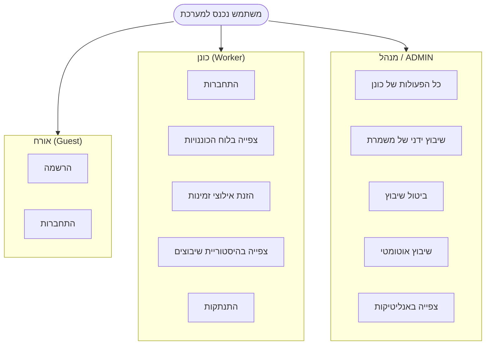
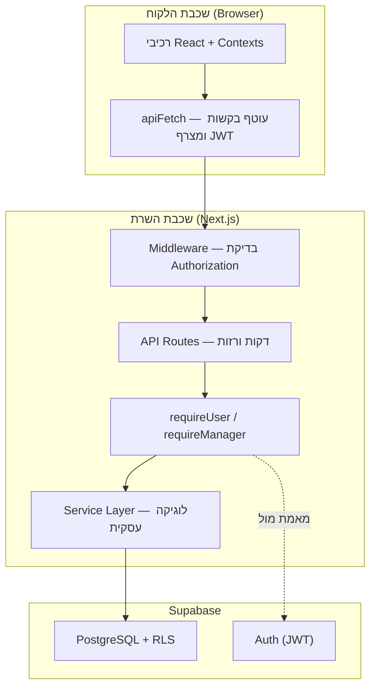
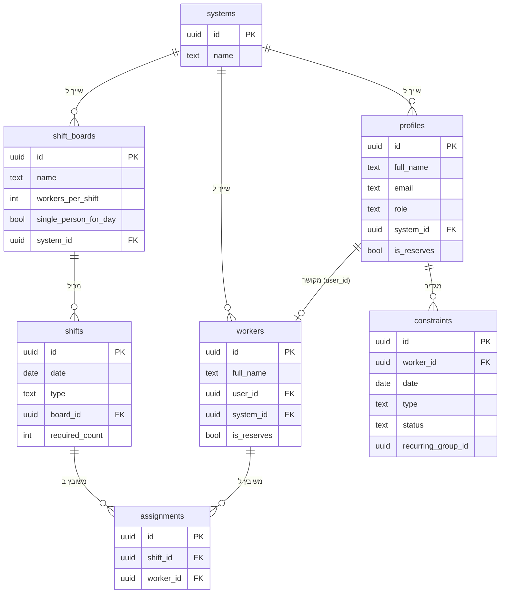
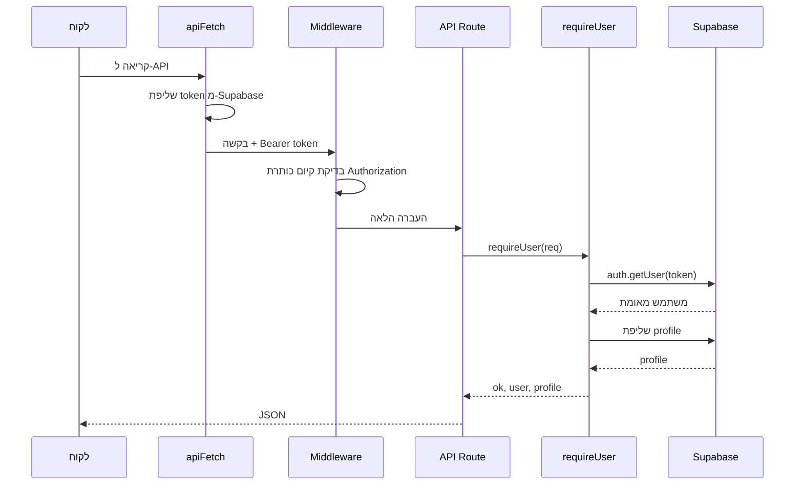
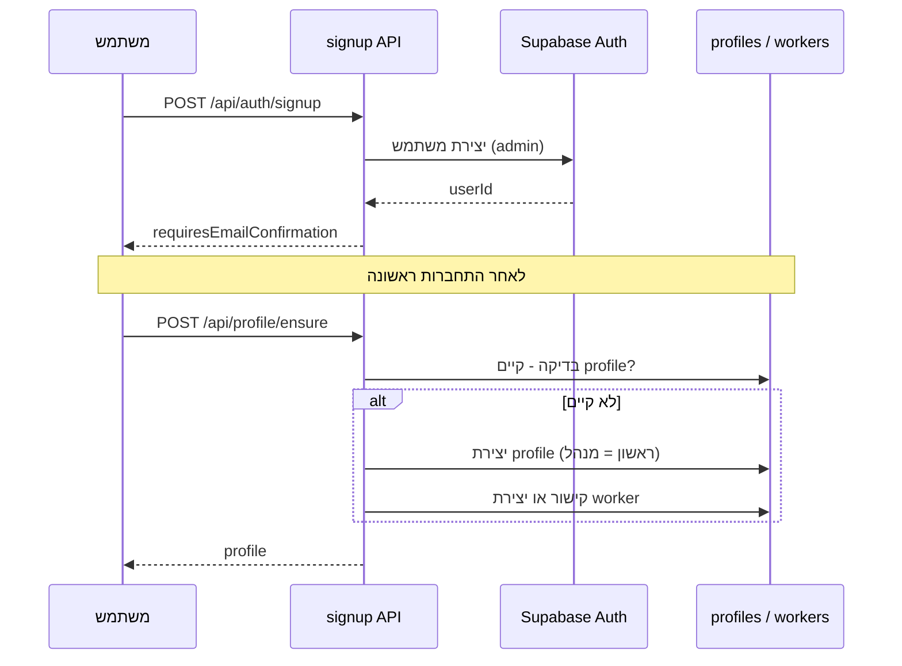
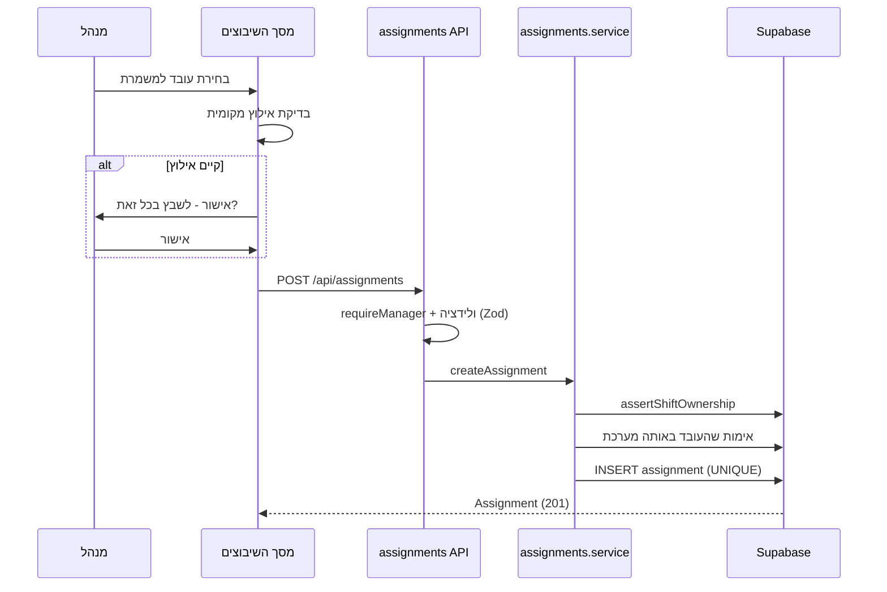
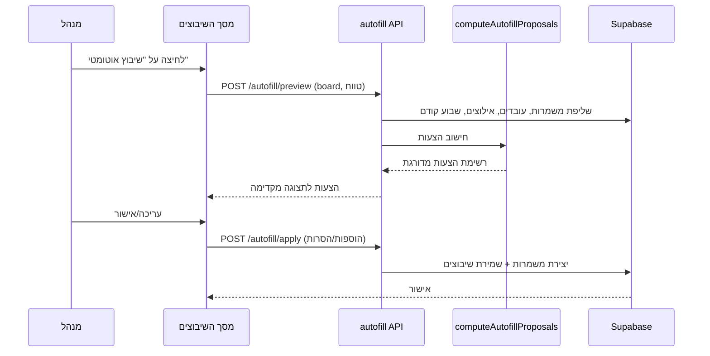
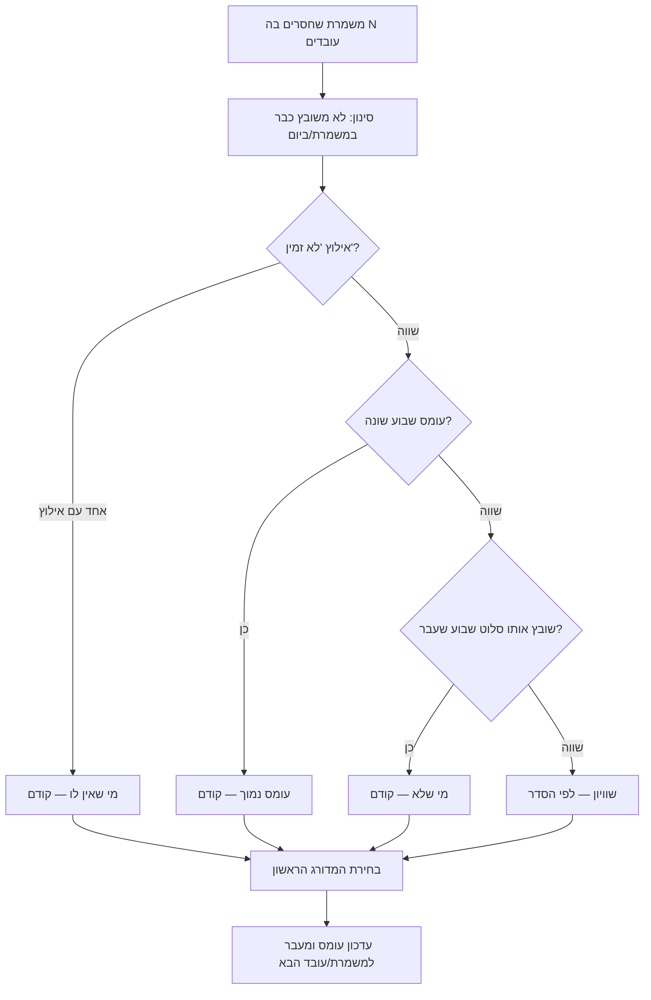

# תיק פרויקט גמר — SmartShift

> **הערה למגישים:** מסמך זה נכתב על בסיס ניתוח קוד המקור של הפרויקט ובהתאמה להצעת הפרויקט שהוגשה. חלקים המסומנים ב-‹...› הם פרטים מנהליים שיש להשלים (תאריך הגשה, חתימות). מומלץ להעתיק ל-Word, לעצב לפי דרישות המכללה (גופן David/Times New Roman, מספרי עמודים, RTL), ולהוסיף צילומי מסך במקומות המסומנים. דוגמאות הקוד מובאות מקוד המקור האמיתי של המערכת.

---

# 1. פתיח (עמוד שער)

<div align="center">

**שם המכללה:** בסמ"ח (סמל מכללה: 71605)

**מגמת הלימוד:** הנדסת תוכנה

**מסלול הכשרה:** טכנאים מוסמכים

<br>

## נושא פרויקט הגמר
### SmartShift — מערכת חכמה לניהול ושיבוץ כוננויות ומשמרות

<br>

**שם המגישים:** אלה לוי · שי לב טוב

**שם המנחה האישי:** יוסף בדר

**מקום ביצוע הפרויקט:** בסמ"ח

**תאריך הגשה:** ‹תאריך›

<br>

חתימת הסטודנט: \_\_\_\_\_\_\_\_\_\_\_\_  חתימת המנחה האישי: \_\_\_\_\_\_\_\_\_\_\_\_  חתימת ראש המגמה: \_\_\_\_\_\_\_\_\_\_\_\_

</div>

---

# 2. הצעה לפרויקט גמר

> יש לצרף כאן את **הצעת פרויקט הגמר** החתומה (חוזר מנהל מה"ט 51-4-11 – נספח מס' 1), על ידי הסטודנטים והמנחה האישי, וכן את דפי אישור ראש המגמה והגורם המקצועי מטעם מה"ט.

---

# 3. הצהרת הסטודנט

אנו החתומים מטה, **אלה לוי** (ת"ז 302321559) ו**שי לב טוב** (ת"ז 326568839), מצהירים בזאת כי פרויקט הגמר "SmartShift — מערכת חכמה לניהול ושיבוץ כוננויות ומשמרות" וספר הפרויקט המצ"ב נעשו על ידינו בלבד. פרויקט הגמר וספר הפרויקט נעשו על סמך הנושאים שלמדנו במכללה ובאופן עצמאי. כל מקור שבו נעזרנו צוין במפורש ברשימת המקורות שבספר הפרויקט. אנו מודעים לאחריות שהננו מקבלים על עצמנו על ידי חתימתנו על הצהרה זו שכל הנאמר בה אמת ורק אמת.

תאריך: ‹תאריך›

חתימת אלה לוי: \_\_\_\_\_\_\_\_\_\_\_\_  חתימת שי לב טוב: \_\_\_\_\_\_\_\_\_\_\_\_

---

# 4. הבעת הערכה

> חלק אישי — יש לכתוב תודות לאנשים ולמוסדות שסייעו.

ברצוננו להודות למנחה האישי **יוסף בדר** על ההנחיה המקצועית, התמיכה והליווי לאורך הפרויקט; למכללת **בסמ"ח** ולסגל המרצים על הידע והכלים; ולכל מי שסייע לנו בהכנת פרויקט הגמר וספר הפרויקט.

---

# 5. תקציר

SmartShift היא מערכת ווב לניהול ושיבוץ כוננויות ומשמרות, שפותחה על רקע הצורך המבצעי בהבטחת רציפות תפקודית של מערכות ומענה זמין מסביב לשעון. עד כה נוהלו הכוננויות באופן ידני — לרוב באמצעות הודעות ב-WhatsApp — מה שהוביל להיעדר ראייה מרוכזת של אילוצים וזמינות, לקושי בזיהוי התנגשויות בשיבוץ, ולמעקב לא מסודר אחר היסטוריית השיבוצים. הפרויקט נועד להחליף תהליך זה במערכת דיגיטלית מרכזית, שקופה ואוטומטית.

הליבה הטכנולוגית היא אלגוריתם **שיבוץ אוטומטי** המחשב הצעות שיבוץ על פי שלושה קריטריונים מדורגים: הימנעות מהפרת אילוצי זמינות, איזון עומס בין הכוננים, וגיוון ביחס לשבוע הקודם. המערכת נבנתה כאפליקציית Full-Stack מבוססת Next.js ו-Supabase (PostgreSQL), עם הפרדת הרשאות לפי תפקידים (מנהל / מפקד / כונן / אורח), אבטחת מידע ברמת השורה (RLS) ותמיכה במספר יחידות ארגוניות במקביל. הממשק בעברית (RTL) ותומך במצב כהה. המטרות שנקבעו בהצעת הפרויקט — ניהול לוחות ומשמרות, איסוף אילוצים ושיבוץ אוטומטי מבוקר — הושגו, והתוצר הוא מערכת עובדת מקצה לקצה.

*(‏~200 מילים)*

---

# 6. תוכן העניינים

1. פתיח
2. הצעה לפרויקט גמר
3. הצהרת הסטודנט
4. הבעת הערכה
5. תקציר
6. תוכן העניינים
7. רשימת תרשימים וטבלאות
8. **גוף העבודה**
   - 8.1 מבוא (רקע, בעיה, מטרות, דרישות, Use Case)
   - 8.2 עקרונות התכנון והבנייה (טכנולוגיות, ארכיטקטורה)
   - 8.3 ניתוח המערכת — מבנה בסיס הנתונים (DB)
   - 8.4 ניתוח המערכת — צד השרת (מודולים, Endpoints, דיאגרמות רצף)
   - 8.5 המרכיב האלגוריתמי — שיבוץ אוטומטי ואנליטיקות
   - 8.6 ניתוח המערכת — צד הלקוח (Frontend)
   - 8.7 אבטחת מידע
   - 8.8 דוגמאות קוד — צד שרת
   - 8.9 דוגמאות קוד — צד לקוח
   - 8.10 תיאור תהליכים
   - 8.11 מדידות, בדיקות ותוצאות
9. סיכום, מסקנות והמלצות
10. שונות (משאבים, תוכנית עבודה, בקרת גרסאות)
11. ביבליוגרפיה

---

# 7. רשימת תרשימים וטבלאות

| מס' | סוג | תיאור |
|----|-----|-------|
| תרשים 1 | Use Case | תרחישי שימוש לפי תפקידים (אורח / כונן / מנהל) |
| תרשים 2 | ארכיטקטורה | תרשים שכבות המערכת (Client → API → Service → DB) |
| תרשים 3 | ERD | מודל הנתונים — טבלאות ויחסים |
| תרשים 4 | רצף | זרימת אימות והתחברות (Login / Authentication) |
| תרשים 5 | רצף | זרימת הרשמה ויצירת פרופיל (Register) |
| תרשים 6 | רצף | שיבוץ ידני עם בדיקת אילוץ |
| תרשים 7 | רצף | זרימת שיבוץ אוטומטי (Autofill) |
| תרשים 8 | תרשים זרימה | אלגוריתם דירוג המועמדים לשיבוץ |
| טבלה 1 | טכנולוגיות | ערימת הטכנולוגיות והגרסאות |
| טבלה 2 | הרשאות | מטריצת תפקידים ↔ פעולות |
| טבלה 3 | DB | תיאור הטבלאות והעמודות |
| טבלה 4 | API | טבלת נקודות הקצה (Endpoints) המלאה |
| טבלה 5 | תוצאות | תרחישי בדיקה ותוצאות |
| טבלה 6 | משאבים | חלוקת תפקידים בצוות |

> **הערה:** לצילומי מסך של המסכים — ראו סעיף 8.6. יש להוסיף את הצילומים בפועל ולסמן כ"תמונה 1", "תמונה 2" וכו'.

---

# 8. גוף העבודה

## 8.1 מבוא

### 8.1.1 רקע והמניע לפרויקט

הצורך בפרויקט עלה מתוך סביבה מבצעית: הבטחת רציפות תפקודית של מערכות תוך ניטור פרו-אקטיבי מסביב לשעון. הסביבה המבצעית המורכבת מחייבת זמינות גבוהה של כוח אדם בכל רגע נתון, וזיהוי מוקדם של תקלות או חריגות בזמן אמת. לאור זאת גובש רעיון לפיתוח מערכת חכמה לניהול ושיבוץ כוננים, אשר תאפשר חלוקה אופטימלית של כוח האדם תוך התחשבות בזמינות, בעומסים ובהיסטוריית השיבוצים — ובכך תשפר את היעילות והמוכנות המבצעית ותבטיח מענה רציף ואיכותי לכל אירוע.

### 8.1.2 הגדרת הבעיה — המצב הקיים

עד לפיתוח המערכת, ניהול הכוננויות התבצע בעיקר באמצעות הודעות ב-WhatsApp. שיטה זו הובילה למספר בעיות מרכזיות:

1. **היעדר ראייה מרוכזת** של אילוצי הזמינות והזמינות של כלל הכוננים.
2. **קושי בזיהוי התנגשויות** בשיבוץ (למשל כוננות בשבת בערב ואחריה משמרת ביום ראשון בבוקר).
3. **מעקב לא מסודר** אחר שיבוצים קודמים, ללא היסטוריה ברורה.
4. **בלבול וחוסר אחידות** במידע וקושי במעקב אחר שינויים והחלפות במהלך השבוע.

מצב זה גרם לטעויות חוזרות ולחוסר יעילות. הצורך במערכת מסודרת נובע מהרצון לייצר שקיפות, סדר ומעקב ברור — כך שכל המידע יהיה נגיש, עקבי ומובן לכלל המשתמשים.

### 8.1.3 מטרות הפרויקט והחידוש

מטרת המערכת המרכזית היא לייצר תהליך שיבוץ אופטימלי, המתחשב בפרמטרים מגוונים כגון אילוצים, זמינות והיסטוריית שיבוצים, ובכך לאפשר זמינות גבוהה של כוח אדם. הפרויקט נועד לחדש ולשפר באמצעות **מעבר מניהול ידני ולא מסודר למערכת חכמה ואוטומטית**, אשר: מספקת תמונת מצב מלאה בזמן אמת; מפחיתה טעויות אנוש; משפרת את השקיפות ומייעלת את קבלת ההחלטות; ומאפשרת תגובה מהירה לשינויים.

### 8.1.4 דרישות המערכת (פונקציונליות ולא-פונקציונליות)

**דרישות לא-פונקציונליות:** עבודה רציפה 24/7, גישה למספר תפקידים במקביל, זמינות ויציבות לאורך זמן, ביצוע שיבוצים ועדכונים בזמן קצר גם תחת עומסים, והגנה על מידע קריטי.

**דרישות פונקציונליות (מתוך ההצעה, ומימושן בפועל):**

| # | דרישה | מומש |
|---|-------|:----:|
| 1 | הרשמת משתמשים חדשים והזנת פרטים (מערכת, אימייל, סוג משתמש) לצורך התאמת הרשאות | ✔ |
| 2 | צפייה מלאה בלוח הכוננויות של כלל המשתמשים | ✔ |
| 3 | שיבוץ, עדכון וביטול כוננויות למשתמשי admin תוך שמירה על עקביות | ✔ |
| 4 | הזנת אילוצי זמינות ומעקב אחריהם בעת השיבוץ | ✔ |
| 5 | שמירת היסטוריית שיבוצים ומניעת עומסים לא מאוזנים | ✔ |
| 6 | דשבורד ותצוגות ויזואליות (עומסים, זמינות, היסטוריה) לסיוע בהחלטות | ✔ (בסיסי) |
| 7 | התראות למשתמשים על שיבוץ חדש או שינוי בכוננות | ✖ (הרחבה עתידית) |

### 8.1.5 תרחישי שימוש (Use Case)

**תרשים 1 — תרחישי שימוש לפי תפקיד:**



---

## 8.2 עקרונות התכנון והבנייה

### 8.2.1 בחירת הטכנולוגיות

בהתאם להצעת הפרויקט, נבחרה ארכיטקטורת Client–Server שבה הלקוח פועל בדפדפן ומתקשר עם שרת מרכזי דרך API, והמערכת נפרסת בענן לזמינות גבוהה.

**טבלה 1 — ערימת הטכנולוגיות:**

| רכיב | טכנולוגיה | גרסה | תפקיד |
|------|-----------|------|-------|
| Framework | Next.js (App Router) | 16.2.1 | רינדור צד-שרת, ניתוב, שכבת API (Backend) |
| ספריית UI | React / React DOM | 19.2.3 | בניית ממשק דינמי מבוסס רכיבים (Frontend) |
| שפה | TypeScript | 5.x | שפת הפיתוח הראשית, טיפוסיות סטטית |
| בסיס נתונים ואימות | Supabase (PostgreSQL + Auth + RLS) | 2.98.0 | ניהול נתונים רלציוניים, אימות משתמשים, הרשאות |
| ולידציה | Zod | 4.3.6 | אימות מבנה קלט בזמן ריצה |
| הגבלת קצב | Upstash Redis / Ratelimit | 1.37 / 2.0.8 | הגנה מפני שימוש לרעה |
| עיצוב | Tailwind CSS | v4 | עיצוב, מצב כהה, תמיכת RTL |
| רכיבי UI | Headless UI / Heroicons | 2.2.9 / 2.2.0 | רכיבים נגישים ואייקונים |
| איכות קוד | ESLint / Prettier | 9 / 3.8 | תקן קוד ועיצוב אוטומטי |

**שפות פיתוח:** TypeScript (השפה הראשית), SQL (מיגרציות ושאילתות), HTML/CSS (עיצוב קומפוננטות).

**שיקולי הבחירה וטכנולוגיות שנשקלו (Alternatives):**

- **Framework — Next.js לעומת Express/NestJS + SPA נפרד:** בחרנו ב-Next.js משום שהוא מאחד בקוד-בייס אחד את הלקוח (React) ואת שכבת ה-API (Route Handlers), עם TypeScript משותף בין השרת ללקוח. זה מפשט את הפיתוח ומקטין שכפול טיפוסים, לעומת ארכיטקטורה של שרת Node נפרד (Express/NestJS) עם אפליקציית SPA נפרדת, שדורשת תחזוקת שני פרויקטים וסנכרון טיפוסים ידני.
- **בסיס נתונים ואימות — Supabase לעומת Firebase או שרת מותאם:** Supabase מספק PostgreSQL (בסיס נתונים רלציוני עם תמיכה ב-ACID ומפתחות זרים), מנגנון אימות מובנה, והכי חשוב — **Row-Level Security (RLS)**, המאפשר לאכוף הרשאות ברמת בסיס הנתונים עצמו כשכבת הגנה שנייה מעבר לקוד. לעומת Firebase (בסיס נתונים מסמכי לא-רלציוני), PostgreSQL מתאים יותר למודל היחסי של משמרות, שיבוצים ואילוצים.
- **בטיחות טיפוסים וקלט — TypeScript + Zod:** TypeScript מספק בטיחות טיפוסים בזמן פיתוח, אך אינו מגן על קלט חיצוני בזמן ריצה. לכן שולב **Zod** — ספריית ולידציה המאמתת את מבנה גוף הבקשה בכל נקודת קצה, וסוגרת את הפער שבו נתונים המגיעים מהלקוח אינם מובטחים.

**נימוק כולל:** יציבות, תמיכה בעבודה מקבילית, יכולת סקיילינג, תחזוקה קלה ותמיכה רחבה בספריות — התאמה למערכת Web מודרנית.

### 8.2.2 ארכיטקטורה כללית

המערכת בנויה בארכיטקטורת שכבות ברורה, כאשר כל שכבה מדברת רק עם השכבה שמתחתיה:

**תרשים 2 — ארכיטקטורת השכבות:**



**עקרון מנחה:** נתיבי ה-API (`app/api/`) הם **"דקים"** — הם מאמתים הרשאות, מפרשים את הבקשה, קוראים לפונקציית שירות ומחזירים JSON. כל הלוגיקה העסקית מרוכזת בשכבת השירותים (`features/*/server/`). הפרדה זו משפרת תחזוקתיות ומאפשרת בדיקות יחידה של הלוגיקה במנותק מ-HTTP.

**חלוקה למודולים (מבנה מבוסס-תכונות):** הקוד מאורגן לפי תחומים עסקיים ולא לפי סוג קובץ:

```
app/         # מסכים ו-API (App Router)
features/     # שיבוצים, אילוצים, פרופילים, עובדים — לכל אחד components/hooks/contexts/server
lib/          # api, auth, db, assignments (אלגוריתם), utils (enums, schemas, errors)
supabase/migrations/  # קבצי SQL של סכמת בסיס הנתונים
components/   # רכיבי UI כלליים
```

---

## 8.3 ניתוח המערכת — מבנה בסיס הנתונים (DB)

האחסון הראשי מתבצע ב-PostgreSQL של Supabase. אין שימוש ב-ORM — הגישה לנתונים מתבצעת ישירות דרך Supabase JS SDK בשאילתות פרמטריות. בסיס הנתונים כולל שבע טבלאות מרכזיות.

**תרשים 3 — מודל הנתונים (ERD):**



**טבלה 3 — תיאור הטבלאות והעמודות המרכזיות:**

| טבלה | תפקיד | עמודות מרכזיות |
|------|-------|----------------|
| `systems` | יחידה ארגונית (רב-דיירות) | `id`, `name` |
| `profiles` | פרופיל משתמש רשום והרשאות | `id`, `full_name`, `email`, `role`, `system_id`, `is_reserves` |
| `workers` | כונן שניתן לשבץ (עם/בלי חשבון) | `id`, `full_name`, `user_id` (nullable), `system_id`, `is_reserves` |
| `shift_boards` | לוח שיבוצים (תבנית) | `id`, `name`, `workers_per_shift`, `single_person_for_day`, `system_id` |
| `shifts` | משמרת | `id`, `date`, `type` (day/night/full_day), `board_id`, `required_count` |
| `assignments` | שיוך עובד למשמרת | `id`, `shift_id`, `worker_id`, `UNIQUE(shift_id, worker_id)` |
| `constraints` | אילוץ זמינות | `id`, `worker_id`, `date`, `type`, `status`, `recurring_group_id` |

**מיגרציית בסיס הנתונים הראשונית (קטע):**

```sql
create table if not exists public.shifts (
  id uuid primary key default gen_random_uuid(),
  date date not null,
  type text not null,
  created_by uuid references public.profiles(id) on delete set null,
  board_id uuid references public.shift_boards(id) on delete cascade,
  required_count integer not null default 1 check (required_count >= 1),
  created_at timestamptz not null default now()
);

create table if not exists public.assignments (
  id uuid primary key default gen_random_uuid(),
  shift_id uuid not null references public.shifts(id) on delete cascade,
  worker_id uuid not null references public.workers(id) on delete cascade,
  created_at timestamptz not null default now(),
  constraint assignments_shift_worker_unique unique (shift_id, worker_id)
);
```

**החלטות תכנון מרכזיות:**
- **הפרדה בין `profiles` ל-`workers`:** משתמש רשום הוא ישות אימות, בעוד `worker` הוא ישות שניתן לשבץ. ההפרדה מאפשרת למנהל להוסיף כונן למאגר עוד לפני שנרשם (עם `user_id = null`), וכשהכונן נרשם — הפרופיל מקושר אוטומטית לרשומת העובד הקיימת.
- **רב-דיירות (`system_id`):** כל הטבלאות נושאות `system_id`, המאפשר למספר יחידות ארגוניות לפעול בבידוד מלא.
- **אילוצים מחזוריים:** אילוצים שנוצרו יחד (מחזור שבועי או טווח) חולקים `recurring_group_id` — מאפשר עריכה/מחיקה של סדרה שלמה.
- **מפתח ייחודיות `UNIQUE(shift_id, worker_id)`:** מונע שיבוץ כפול של אותו עובד לאותה משמרת ברמת בסיס הנתונים.

**התאוששות מנפילות וטרנזקציות:** PostgreSQL מספק תמיכה ב-ACID ועמידות מידע, מפתחות זרים (Foreign Keys) ו-Row Level Security. פעולות בודדות במסד הנתונים הן אטומיות. פעולות מורכבות מרובות-שלבים (כגון החלת שיבוץ אוטומטי) אינן עטופות עדיין בטרנזקציה מלאה, ולכן במקרה קריסה נדיר ייתכנו שינויים חלקיים — נושא שנכלל בהמלצות להמשך.

---

## 8.4 ניתוח המערכת — צד השרת (Backend)

### 8.4.1 שכבות ומודולים

צד השרת בנוי בשלוש שכבות:

1. **נתיבי API (Route Handlers)** תחת `app/api/` — "דקים": אימות הרשאה, ולידציה, קריאה לשירות, החזרת JSON.
2. **שכבת האימות וההרשאות** תחת `lib/auth/` — `requireUser`, `requireManager`, ו-`assertOwnership` (בדיקות בעלות ארגונית).
3. **שכבת השירותים (Business Logic)** תחת `features/*/server/*.service.ts` — כל הלוגיקה העסקית.

מודולי השירות המרכזיים:

- **`assignments.service.ts`** — `getAssignmentsOverview()` (שליפה מקבילית בשלושה שלבים + סנכרון עובדים), `createAssignment()`, `deleteAssignment()`.
- **`autofill.service.ts`** — `previewAutofill()` (חישוב הצעות ללא שמירה), `applyAutofill()` (יצירת משמרות חסרות, הסרות והוספות).
- **`constraints.service.ts`** — `createConstraint()` (בודד / מחזורי / טווח), `updateConstraint()`, `deleteConstraint()`.
- **`profile.service.ts`** — `ensureProfile()` (יצירה/סנכרון + קביעת תפקיד), `promoteProfile()`, `listProfiles()`.
- **`workers.service.ts`** — `listWorkers()`, `createWorker()`, `deleteWorker()`.

### 8.4.2 טבלת נקודות הקצה (Endpoints)

**טבלה 4 — טבלת ה-Endpoints המלאה:**

| Controller | Verb | Endpoint | Auth | תיאור |
|-----------|------|----------|------|-------|
| Assignments | GET | `/api/assignments` | user | סקירת שיבוצים מלאה (משמרות, שיבוצים, עובדים, אילוצים, לוחות) |
| Assignments | POST | `/api/assignments` | manager | שיבוץ עובד למשמרת |
| Assignments | DELETE | `/api/assignments?assignment_id=` | manager | הסרת שיבוץ |
| Autofill | POST | `/api/assignments/autofill/preview` | manager | תצוגה מקדימה של שיבוץ אוטומטי |
| Autofill | POST | `/api/assignments/autofill/apply` | manager | החלת שיבוץ אוטומטי (הוספות/הסרות) |
| Shifts | GET | `/api/shifts` | user | רשימת משמרות (סינון לפי type/board) |
| Shifts | POST | `/api/shifts` | manager | יצירת משמרת |
| Shifts | PATCH | `/api/shifts/{id}` | manager | עדכון משמרת |
| Shifts | DELETE | `/api/shifts/{id}` | manager | מחיקת משמרת |
| Constraints | GET | `/api/constraints?all=` | user | אילוצים (של המשתמש או כל היחידה למנהל) |
| Constraints | POST | `/api/constraints` | user (לא אורח) | יצירת אילוץ (בודד/מחזורי/טווח) |
| Constraints | PATCH | `/api/constraints/{id}` | user (לא אורח) | עדכון אילוץ |
| Constraints | DELETE | `/api/constraints/{id}?series=` | user (לא אורח) | מחיקת אילוץ (בודד או סדרה) |
| Boards | GET | `/api/boards` | user | רשימת לוחות ביחידה |
| Boards | POST | `/api/boards` | manager | יצירת לוח |
| Workers | GET | `/api/workers` | manager | מאגר העובדים ביחידה |
| Workers | POST | `/api/workers` | manager | הוספת עובד ידני (ללא חשבון) |
| Workers | DELETE | `/api/workers/{id}` | manager | מחיקת עובד (רק ללא חשבון) |
| Profiles | GET | `/api/profiles` | manager | רשימת המשתמשים ביחידה |
| Profiles | POST | `/api/profiles/{id}/promote` | manager | קידום עובד למנהל/מפקד |
| Profile | GET | `/api/profile/me` | user | הפרופיל של המשתמש הנוכחי |
| Profile | POST | `/api/profile/ensure` | user | יצירה/סנכרון פרופיל |
| Systems | GET | `/api/systems` | ציבורי | רשימת יחידות (למסך הרשמה) |
| Systems | POST | `/api/systems` | manager | יצירת יחידה |
| Auth | POST | `/api/auth/signup` | ציבורי | הרשמת משתמש חדש |

### 8.4.3 דיאגרמות רצף (Sequence Diagrams)

**תרשים 4 — זרימת אימות והתחברות (Login / Authentication):**



**תרשים 5 — זרימת הרשמה ויצירת פרופיל (Register):**



**תרשים 6 — שיבוץ ידני עם בדיקת אילוץ:**



---

### 8.4.4 רשימת המחלקות והמודולים בצד השרת (Backend)

המערכת כתובה ב-TypeScript בגישה מודולרית-פונקציונלית. לצד פונקציות השירות, קיימות במערכת **שתי מחלקות ממש (Classes)**: `ServiceError` ו-`ForbiddenError` (מחלקות שגיאה מותאמות). להלן רשימת כל המחלקות והמודולים בצד השרת:

**א. Middleware ותצורה**

| מודול | קובץ | תפקיד |
|-------|------|-------|
| Middleware | `middleware.ts` | בדיקת כותרת `Authorization` בשער ה-API |
| NextConfig | `next.config.mjs` | תצורת Next, כותרות אבטחה ו-CSP |

**ב. נתיבי API (Route Handlers) — `app/api/`**

| מודול | קובץ | פעולות (Verbs) |
|-------|------|----------------|
| AssignmentsRoute | `assignments/route.ts` | GET, POST, DELETE |
| AutofillPreviewRoute | `assignments/autofill/preview/route.ts` | POST |
| AutofillRoute | `assignments/autofill/route.ts` | POST (alias לתצוגה מקדימה) |
| AutofillApplyRoute | `assignments/autofill/apply/route.ts` | POST |
| SignupRoute | `auth/signup/route.ts` | POST |
| BoardsRoute | `boards/route.ts` | GET, POST |
| ConstraintsRoute | `constraints/route.ts` | GET, POST |
| ConstraintByIdRoute | `constraints/[id]/route.ts` | PATCH, DELETE |
| ProfileMeRoute | `profile/me/route.ts` | GET |
| ProfileEnsureRoute | `profile/ensure/route.ts` | POST |
| ProfilesRoute | `profiles/route.ts` | GET |
| PromoteRoute | `profiles/[id]/promote/route.ts` | POST |
| ShiftsRoute | `shifts/route.ts` | GET, POST |
| ShiftByIdRoute | `shifts/[id]/route.ts` | PATCH, DELETE |
| SystemsRoute | `systems/route.ts` | GET, POST |
| WorkersRoute | `workers/route.ts` | GET, POST |
| WorkerByIdRoute | `workers/[id]/route.ts` | DELETE |

**ג. שכבת השירותים (Services) — `features/*/server/`**

| מודול | קובץ | פונקציות עיקריות |
|-------|------|------------------|
| AssignmentsService | `assignments.service.ts` | `getAssignmentsOverview`, `createAssignment`, `deleteAssignment` |
| AutofillService | `autofill.service.ts` | `previewAutofill`, `applyAutofill` |
| ConstraintsService | `constraints.service.ts` | `getConstraints`, `createConstraint` (בודד/מחזורי/טווח), `updateConstraint`, `deleteConstraint` |
| ProfileService | `profile.service.ts` | `ensureProfile`, `promoteProfile`, `listProfiles`, `linkOrCreateWorker` |
| WorkersService | `workers.service.ts` | `listWorkers`, `createWorker`, `deleteWorker` |

**ד. אימות והרשאות — `lib/auth/`**

| מודול | קובץ | תוכן |
|-------|------|------|
| RequireUser | `requireUser.ts` | `requireUser` |
| RequireManager | `requireManager.ts` | `requireManager` |
| AssertOwnership | `assertOwnership.ts` | **class `ForbiddenError`**, `assertBoardOwnership`, `assertShiftOwnership`, `assertAssignmentOwnership`, `assertProfileInSystem` |
| AuthHeader | `authHeader.ts` | `getAccessTokenFromRequest` |

**ה. גישה למסד נתונים — `lib/db/`**

| מודול | קובץ | תפקיד |
|-------|------|-------|
| SupabaseServer | `supabaseServer.ts` | לקוח צד-שרת (מכבד RLS) |
| SupabaseAdmin | `supabaseAdmin.ts` | לקוח Admin (עוקף RLS, בהרשאה) |
| SupabaseEnv | `env.ts` | טעינת משתני סביבה |

**ו. אלגוריתם, ולידציה, שגיאות והגבלת קצב — `lib/`**

| מודול | קובץ | תוכן |
|-------|------|------|
| Autofill | `assignments/autofill.ts` | `computeAutofillProposals`, `addDays` |
| ParseBody | `utils/schemas/parseBody.ts` | `parseBody`, `parseUuidParam` |
| ZodSchemas | `utils/schemas/*.ts` | סכמות ולידציה: assignments, constraints, shifts, workers, profiles, boards, systems, auth, common |
| Errors | `utils/errors.ts` | **class `ServiceError`**, `safeErrorMessage`, `safeErrorStatus` |
| RateLimit | `utils/rateLimit.ts` | `rateLimit`, `rateLimitRedis`, `rateLimitMemory` |

**ז. טיפוסים משותפים (Domain) — `lib/utils/`**

| מודול | קובץ | תוכן |
|-------|------|------|
| DomainInterfaces | `interfaces/domain.ts` | `System`, `Profile`, `Worker`, `Shift`, `ShiftBoard`, `Constraint`, `Assignment`, `AssignmentsOverview` |
| Enums | `enums/{role,shiftType,constraintStatus}.ts` | `Role` + `canManage`, `ShiftType`, `ConstraintStatus` |
| ServerContext | `types/ServerSupabaseContext.ts` | טיפוס הקשר לשרת |

---

## 8.5 המרכיב האלגוריתמי — שיבוץ אוטומטי ואנליטיקות

### 8.5.1 הבעיה שהאלגוריתם פותר

המרכיב האלגוריתמי המרכזי הוא מנגנון שיבוץ המשמרות האוטומטי. הוא מסייע ביצירת סידור עבודה הוגן ותקין באמצעות: שיבוץ עובדים למשמרות פתוחות, התחשבות באילוצי זמינות, מניעת שיבוץ כפול באותו יום, איזון עומס בין עובדים, והעדפת גיוון ביחס לשבוע קודם.

### 8.5.2 אופן הפעולה

האלגוריתם (`computeAutofillProposals` בקובץ `lib/assignments/autofill.ts`) מקבל נתוני עובדים, משמרות, אילוצים ושיבוצים קודמים, ומשתמש במבני `Map` ו-`Set` לבדיקות מהירות של זמינות, עומס, שיבוצים קיימים והיסטוריה. האלגוריתם הוא **חמדני (Greedy)** עם דירוג רב-קריטריוני.

**סינון מקדים** — מועמד נפסל אם הוא כבר משובץ באותה משמרת, או כבר משובץ למשמרת אחרת באותו תאריך (מניעת שיבוץ כפול ביום).

**דירוג המועמדים** — הנותרים ממוינים לפי שלושה קריטריונים לפי סדר עדיפות:
1. **אילוץ זמינות** — עובד ללא אילוץ "לא זמין" (`unavailable`) קודם.
2. **עומס שיבוץ** — עובד עם פחות שיבוצים השבוע קודם.
3. **גיוון** — עובד שלא שובץ לאותה משמרת/תאריך בשבוע שעבר קודם.

**תרשים 7 — זרימת שיבוץ אוטומטי:**



**תרשים 8 — לוגיקת דירוג המועמדים:**



חשוב להדגיש: האלגוריתם מייצר **הצעה בלבד**. המנהל צופה בתצוגה מקדימה (Preview), רשאי להחליף כל שיבוץ מוצע, ורק לאחר אישור מפורש השיבוץ נשמר. גישה זו משלבת יעילות אוטומטית עם שליטה אנושית מלאה.

**חישוב מורכבות:** עבור *S* משמרות, *W* עובדים ו-*R* עובדים נדרשים לכל משמרת, המורכבות היא כ-*O(S · R · W log W)* — לכל מקום פנוי מתבצע מיון של המועמדים. עבור ממדים ריאליסטיים (עשרות עובדים ומשמרות) זמן החישוב זניח.

### 8.5.3 אנליטיקות

המערכת אוספת נתוני עובדים, משמרות ושיבוצים ומציגה בדשבורד סטטיסטיקות כגון מספר משמרות לעובד, חלוקה למשמרות יום/לילה, עומס עבודה שבועי, ומשמרות מלאות/חסרות עובדים — לסיוע בקבלת החלטות בשיבוץ הידני.

---

## 8.6 ניתוח המערכת — צד הלקוח (Frontend)

ניהול המצב בצד הלקוח מבוסס על **React Context** עם מטמון ברמת המודול (module-level cache) השורד ניווט בין מסכים:

- **`ProfileContext`** — מחזיק את פרופיל המשתמש הנוכחי גלובלית (באמצעות `useSyncExternalStore`), ומאזין לשינויי אימות (התנתקות / רענון טוקן).
- **`AssignmentsContext`** — טוען וממטמן את סקירת השיבוצים, עם עדכונים אופטימיים (Optimistic updates) לאחר שיבוץ.
- **`ConstraintsContext`** — מנהל את רשימת האילוצים ואת חברי היחידה (למנהל).

הוקים מותאמים (Hooks) מרכזיים: `useWeekNavigation` (ניווט שבועי וחישוב התקדמות) ו-`useAutofill` (זרימת השיבוץ האוטומטי — תצוגה מקדימה, עריכה ואישור). כל קריאות ה-API מהלקוח עוברות דרך `lib/api/apiFetch.ts`, העוטף `fetch` ומצרף אוטומטית את ה-JWT. הממשק (GUI) מבוסס Web עם תמיכת RTL, מצב כהה (Dark Mode) והתאמה למובייל ולדסקטופ.

### רשימת המחלקות והמודולים בצד הלקוח (Frontend)

צד הלקוח מבוסס React (רכיבים פונקציונליים, Contexts ו-Hooks). להלן רשימת כל המחלקות והמודולים בצד הלקוח:

**א. דפים (Pages) — `app/`**

| מודול | קובץ | תפקיד |
|-------|------|-------|
| RootPage | `app/page.tsx` | דף כניסה ראשי |
| RootLayout | `app/layout.tsx` | Layout שורש (ThemeProvider, ProfileProvider) |
| LoginPage | `(auth)/login/page.tsx` | מסך התחברות |
| SignupPage | `(auth)/signup/page.tsx` | מסך הרשמה |
| DashboardLayout | `(dashboard)/layout.tsx` | Layout מוגן (Navbar, הפניית לא-מחוברים) |
| DashboardPage | `(dashboard)/dashboard/page.tsx` | לוח מחוונים |
| AssignmentsPage | `(dashboard)/assignments/page.tsx` | מסך שיבוצים |
| ConstraintsPage | `(dashboard)/constraints/page.tsx` | מסך אילוצים |
| SettingsPage | `(dashboard)/settings/page.tsx` | מסך הגדרות |

**ב. ניהול מצב (Contexts) — `features/*/contexts/`**

| מודול | קובץ | ייצוא |
|-------|------|-------|
| ProfileContext | `profile/contexts/ProfileContext.tsx` | `ProfileProvider`, `useProfile` |
| AssignmentsContext | `assignments/contexts/AssignmentsContext.tsx` | `AssignmentsProvider`, `useAssignments` |
| ConstraintsContext | `constraints/contexts/ConstraintsContext.tsx` | `ConstraintsProvider`, `useConstraints` |

**ג. הוקים מותאמים (Hooks) — `features/*/hooks/`**

| מודול | קובץ | תפקיד |
|-------|------|-------|
| useAutofill | `assignments/hooks/useAutofill.ts` | ניהול זרימת השיבוץ האוטומטי |
| useWeekNavigation | `assignments/hooks/useWeekNavigation.ts` | ניווט שבועי וחישוב התקדמות |

**ד. רכיבי תכונה (Feature Components) — `features/*/components/`**

| מודול | קובץ | תפקיד |
|-------|------|-------|
| AssignWorkerModal | `assignments/components/AssignWorkerModal.tsx` | חלון בחירת עובד למשמרת |
| AutofillPreviewModal | `assignments/components/AutofillPreviewModal.tsx` | תצוגה מקדימה של שיבוץ אוטומטי |
| ConstraintConfirmModal | `assignments/components/ConstraintConfirmModal.tsx` | אישור שיבוץ למרות אילוץ |
| CreateBoardModal | `assignments/components/CreateBoardModal.tsx` | יצירת לוח חדש |
| ShiftListView | `assignments/components/ShiftListView.tsx` | תצוגת רשימה של משמרות |
| DeleteChoiceModal | `constraints/components/DeleteChoiceModal.tsx` | בחירת מחיקה: בודד או סדרה |

**ה. רכיבי UI כלליים — `components/`**

| מודול | קובץ | תפקיד |
|-------|------|-------|
| Checkbox | `Checkbox.tsx` | תיבת סימון |
| Dropdown | `Dropdown.tsx` | רשימה נפתחת |
| ErrorBoundary | `ErrorBoundary.tsx` | תפיסת שגיאות רינדור |
| Logo | `Logo.tsx` | לוגו |
| Navbar | `Navbar.tsx` | סרגל ניווט |
| ThemeProvider | `ThemeProvider.tsx` | ניהול מצב כהה/בהיר |
| ThemeScript | `ThemeScript.tsx` | מניעת הבהוב ערכת נושא |
| DrawerShell | `assignments/DrawerShell.tsx` | מעטפת מגירה צדית |
| ShiftDetailsDrawer | `assignments/ShiftDetailsDrawer.tsx` | מגירת פרטי משמרת |
| WorkerDetailsDrawer | `assignments/WorkerDetailsDrawer.tsx` | מגירת פרטי עובד |
| SectionHeader | `dashboard/SectionHeader.tsx` | כותרת מקטע |
| ShiftBlock | `dashboard/ShiftBlock.tsx` | תא משמרת בלוח |
| StatCard | `dashboard/StatCard.tsx` | כרטיס סטטיסטיקה |
| WeekRow | `dashboard/WeekRow.tsx` | שורת יום בלוח השבועי |
| WeekSummaryStrip | `dashboard/WeekSummaryStrip.tsx` | פס סיכום שבועי |

**ו. תשתית לקוח ועזר — `lib/` ו-`features/*/utils`**

| מודול | קובץ | תפקיד |
|-------|------|-------|
| apiFetch | `lib/api/apiFetch.ts` | עוטף בקשות + צירוף JWT אוטומטי |
| SupabaseBrowser | `lib/db/supabaseBrowser.ts` | לקוח Supabase (singleton בדפדפן) |
| AssignmentsUtils | `features/assignments/utils.ts` | פונקציות עזר (טווחי תאריכים, בדיקת תאריך עבר) |
| ConstraintsUtils | `features/constraints/utils.ts` | פונקציות עזר לאילוצים |

---

### מסכי המערכת (תצוגות)

> **הערה:** להוסיף כאן צילום מסך לכל מסך (תמונה 1–5).

1. **מסך התחברות / הרשמה** (`/login`, `/signup`) — בהרשמה בוחר המשתמש יחידה וסוג משתמש (כונן רגיל / כונן במילואים / אורח).
2. **לוח המחוונים (Dashboard)** (`/dashboard`) — תצוגה שבועית של המשמרות (יום/לילה), סטטיסטיקות אישיות, ניווט בין שבועות, וסימון סטטוס מילוי בצבעים (ירוק=מלא, כתום=חלקי, אדום=ריק).
3. **מסך השיבוצים** (`/assignments`) — מסך הניהול המרכזי: תצוגת לוח שבועי או רשימה, שיבוץ עובדים בלחיצה, יצירת משמרות ולוחות, וכפתור השיבוץ האוטומטי הפותח חלון תצוגה מקדימה.
4. **מסך האילוצים** (`/constraints`) — יצירת אילוצים (בודד/מחזורי/טווח), סינון לפי תאריך ועובד, ומחיקת סדרה שלמה.
5. **מסך הגדרות** (`/settings`).

---

## 8.7 אבטחת מידע

המערכת מטפלת במידע רגיש (שיבוצים, זמינות משתמשים והרשאות), ולכן נדרשת הגנה במספר שכבות. המערכת מגדירה ארבעה תפקידים: **מנהל (manager)**, **מפקד (commander)**, **כונן (worker)** ו**אורח (guest)**. הפונקציה `canManage(role)` מחזירה "אמת" למנהל ולמפקד.

**טבלה 2 — מטריצת הרשאות:**

| פעולה | מנהל / מפקד | כונן | אורח |
|-------|:-----------:|:----:|:----:|
| צפייה בלוח הכוננויות | ✔ | ✔ | ✔ |
| יצירה/עריכה/מחיקה של משמרות ולוחות | ✔ | ✖ | ✖ |
| שיבוץ וביטול שיבוץ | ✔ | ✖ | ✖ |
| הפעלת שיבוץ אוטומטי | ✔ | ✖ | ✖ |
| ניהול אילוצים אישיים | ✔ | ✔ | ✖ |
| צפייה באילוצי כלל הכוננים | ✔ | ✖ | ✖ |
| קידום עובד לתפקיד ניהולי | ✔ | ✖ | ✖ |

**אבטחה בשלוש שכבות (Defense-in-Depth):**

1. **Middleware ותקשורת** — כל בקשה ל-`/api/*` (למעט נתיבים ציבוריים כהרשמה) חייבת לשאת כותרת `Authorization: Bearer <token>`. בסביבת ייצור התקשורת מוצפנת ב-HTTPS (נאכף באמצעות כותרת HSTS).
2. **בקרת גישה בקוד (RBAC)** — כל נתיב מוגן קורא ל-`requireUser()` או `requireManager()` לפני כל פעולה, ופונקציות `assert*Ownership()` מוודאות שהמשאב שייך ליחידת המשתמש.
3. **Row-Level Security (RLS)** — מדיניות ברמת בסיס הנתונים אוכפת, למשל, שכונן יכול לקרוא/לערוך רק את האילוצים שבהם `worker_id = auth.uid()`, גם אם שכבת הקוד תיכשל.

**אמצעי אבטחה נוספים:**
- **חשבונות משתמשים:** סיסמאות נשמרות מוצפנות (Hash) על ידי Supabase Auth; אכיפת סיסמאות חזקות.
- **הגבלת קצב (Rate Limiting):** על נקודות קצה רגישות (הרשמה, שיבוץ אוטומטי, קידום) בעזרת Upstash Redis, עם נפילה חלופית לזיכרון מקומי בסביבת פיתוח.
- **הגנה מפני SQL Injection:** שימוש בשאילתות פרמטריות דרך Supabase SDK.
- **Content-Security-Policy** וכותרות אבטחה (X-Frame-Options: DENY, HSTS, nosniff, Permissions-Policy) המוגדרות ב-`next.config.mjs`.
- **הודעות שגיאה בטוחות** (`lib/utils/errors.ts`) — חושפות רק שגיאות מבוקרות ומחזירות "שגיאת שרת פנימית" לכל השאר, כדי לא לדלוף פרטי מימוש.

---

## 8.8 דוגמאות קוד — צד שרת

### 8.8.1 Middleware — בדיקת אימות בשער

```ts
// middleware.ts
import { NextResponse, type NextRequest } from 'next/server';

const PUBLIC_API_PATHS = new Set(['/api/auth/signup', '/api/systems']);

export async function middleware(req: NextRequest) {
  const { pathname } = req.nextUrl;
  if (!pathname.startsWith('/api/')) return NextResponse.next();
  if (PUBLIC_API_PATHS.has(pathname)) return NextResponse.next();

  const authHeader = req.headers.get('authorization');
  if (!authHeader?.startsWith('Bearer ') || authHeader.length < 20) {
    return NextResponse.json({ error: 'Unauthorized' }, { status: 401 });
  }
  return NextResponse.next();
}

export const config = { matcher: ['/api/:path*'] };
```

### 8.8.2 שכבת האימות וההרשאות

```ts
// lib/auth/requireUser.ts
export async function requireUser(req: Request) {
  const accessToken = getAccessTokenFromRequest(req);
  if (!accessToken) {
    return { ok: false as const, status: 401, error: 'Missing bearer token' };
  }

  const supabase: SupabaseClient = getSupabaseServer({ accessToken });

  const { data: userData, error: userError } = await supabase.auth.getUser();
  if (userError || !userData?.user) {
    return { ok: false as const, status: 401, error: 'Invalid session' };
  }

  const { data: profile, error: profileError } = await supabase
    .from('profiles').select('*').eq('id', userData.user.id).single();

  if (profileError || !profile) {
    return { ok: false as const, status: 403, error: 'Missing profile' };
  }

  return { ok: true as const, supabase, user: userData.user, profile: profile as Profile };
}
```

```ts
// lib/auth/requireManager.ts
export async function requireManager(req: Request) {
  const res = await requireUser(req);
  if (!res.ok) return res;
  if (!canManage(res.profile.role)) {
    return {
      ok: false as const,
      status: 403,
      error: 'Only managers or commanders can access this resource',
    };
  }
  return res;
}
```

```ts
// lib/auth/assertOwnership.ts — בדיקת בעלות ארגונית (הגנה שנייה מעל RLS)
export class ForbiddenError extends Error {
  public status = 403;
  constructor(message = 'Access denied') { super(message); }
}

export async function assertBoardOwnership(boardId: string, systemId: string | null): Promise<void> {
  if (!systemId) throw new ForbiddenError('No system assigned');
  const admin = getSupabaseAdmin();
  const { data: board } = await admin
    .from('shift_boards').select('system_id').eq('id', boardId).single();
  if (!board) throw new ForbiddenError('Board not found');
  if (board.system_id !== systemId) {
    throw new ForbiddenError('You do not have permission to access this board');
  }
}

// shift -> board -> system
export async function assertShiftOwnership(shiftId: string, systemId: string | null) {
  const admin = getSupabaseAdmin();
  const { data: shift } = await admin
    .from('shifts').select('id, board_id').eq('id', shiftId).single();
  if (!shift) throw new ForbiddenError('Shift not found');
  if (shift.board_id) await assertBoardOwnership(shift.board_id, systemId);
  return shift;
}
```

### 8.8.3 נתיב API טיפוסי (Route Handler)

```ts
// app/api/assignments/route.ts (קטע)
export async function POST(req: Request) {
  const res = await requireManager(req);
  if (!res.ok) {
    return NextResponse.json({ error: res.error }, { status: res.status });
  }

  const parsed = await parseBody(req, assignmentPostSchema);
  if (!parsed.ok) return parsed.response;

  try {
    const assignment = await createAssignment({
      shiftId: parsed.data.shift_id,
      workerId: parsed.data.worker_id,
      systemId: res.profile.system_id,
      supabase: res.supabase,
    });
    return NextResponse.json(assignment, { status: 201 });
  } catch (err: unknown) {
    return NextResponse.json(
      { error: safeErrorMessage(err) },
      { status: safeErrorStatus(err) }
    );
  }
}
```

נתיב השיבוץ האוטומטי מדגים הוספת **הגבלת קצב** לפני כל שאר הבדיקות:

```ts
// app/api/assignments/autofill/route.ts
export async function POST(req: Request) {
  const limited = await rateLimit(req, { windowMs: 60_000, maxRequests: 10 });
  if (limited) return limited;

  const res = await requireManager(req);
  if (!res.ok) {
    return NextResponse.json({ error: res.error }, { status: res.status });
  }

  const parsed = await parseBody(req, autofillBodySchema);
  if (!parsed.ok) return parsed.response;

  const result = await previewAutofill({ body: parsed.data, systemId: res.profile.system_id });
  return NextResponse.json(result);
}
```

### 8.8.4 שכבת השירותים — יצירת שיבוץ ובדיקות בעלות

```ts
// features/assignments/server/assignments.service.ts (קטע)
export async function createAssignment(params: {
  shiftId: string; workerId: string; systemId: string | null; supabase: SupabaseClient;
}): Promise<Assignment> {
  const { shiftId, workerId, systemId, supabase } = params;

  await assertShiftOwnership(shiftId, systemId);

  const { data: worker } = await supabase
    .from('workers').select('id')
    .eq('id', workerId).eq('system_id', systemId ?? '').single();
  if (!worker) throw new ServiceError('Worker not in your system', 403);

  const admin = getSupabaseAdmin();
  const { data, error } = await admin
    .from('assignments')
    .insert({ shift_id: shiftId, worker_id: workerId })
    .select('*').single();

  if (error || !data) throw new Error(error?.message ?? 'Failed to create assignment');
  return data as Assignment;
}
```

שליפת הסקירה המלאה מדגימה **שליפה מקבילית בשלושה שלבים** (`Promise.all`) לשיפור ביצועים:

```ts
// features/assignments/server/assignments.service.ts (קטע)
// Phase 1: boards + workers במקביל
const [boards, allWorkers] = await Promise.all([
  fetchBoards(admin, systemId),
  fetchWorkers(admin, systemId),
]);

// Phase 2: shifts + סנכרון עובדים במקביל
const [shifts, allWorkersSynced] = await Promise.all([
  fetchShifts(admin, { validBoardIds, type, boardId }),
  syncAndFilterWorkers(admin, allWorkers, systemId),
]);

// Phase 3: assignments + constraints במקביל
const [rawAssignments, constraints] = await Promise.all([
  fetchAssignments(admin, shiftIds),
  fetchConstraints(supabase, { dates, typesFilter, workerIds }),
]);
```

### 8.8.5 יצירת אילוצים — בודד / מחזורי / טווח

```ts
// features/constraints/server/constraints.service.ts (קטע)
export async function createConstraint(params: {
  supabase: SupabaseClient; profile: Profile; body: ConstraintPostBody;
}): Promise<{ single?: Constraint; created?: Constraint[] }> {
  const { supabase, profile, body } = params;

  const status: ConstraintStatus =
    body.status && Object.values(ConstraintStatus).includes(body.status)
      ? body.status : ConstraintStatus.Unavailable;

  if (body.range) return createRangeConstraints(supabase, profile, body, status);
  if (body.recurring) return createRecurringConstraints(supabase, profile, body, status);
  return createSingleConstraint(supabase, profile, body, status);
}
```

יצירת אילוץ מחזורי מייצרת סדרה שלמה עם `recurring_group_id` משותף:

```ts
// createRecurringConstraints (קטע) — כל אותו יום בשבוע, עד שנה קדימה
const groupId = crypto.randomUUID();
const dates: string[] = [];
const cur = new Date(startDate);
while (cur <= endDate) {
  if (cur.getDay() === dayOfWeek) dates.push(toYMD(cur));
  cur.setDate(cur.getDate() + 1);
}
const rows = dates.map((date) => ({
  worker_id: profile.id, date, type: body.type, status,
  note: body.note ?? null, recurring_group_id: groupId,
}));
const { data: created } = await supabase.from('constraints').insert(rows).select('*');
```

### 8.8.6 יצירת/סנכרון פרופיל — המשתמש הראשון הופך למנהל

```ts
// features/profile/server/profile.service.ts (קטע)
const { count } = await supabase
  .from('profiles').select('*', { count: 'exact', head: true });

const role =
  !count || count === 0 ? 'manager'
    : userType === 'guest' ? 'guest'
    : 'worker';
```

### 8.8.7 אלגוריתם השיבוץ האוטומטי (הליבה)

```ts
// lib/assignments/autofill.ts (קטע מרכזי)
for (const shift of shifts) {
  const currentCount = assignedByShift.get(shift.id)?.size ?? 0;
  const required = shift.required_count ?? 1;
  const needed = Math.max(0, required - currentCount);

  for (let i = 0; i < needed; i++) {
    const candidates = eligibleWorkers
      .filter((w) => {
        const alreadyInShift = assignedByShift.get(shift.id)?.has(w.id);
        if (alreadyInShift) return false;
        const alreadyThisDay = datesAssignedByWorker.get(w.id)?.has(shift.date) ?? false;
        if (alreadyThisDay) return false;
        return true;
      })
      .sort((a, b) => {
        // 1) העדפה למי שאין לו אילוץ "לא זמין"
        const aConflict = hasUnavailableConstraint(a.id, shift.date, shiftType);
        const bConflict = hasUnavailableConstraint(b.id, shift.date, shiftType);
        if (aConflict !== bConflict) return aConflict ? 1 : -1;
        // 2) איזון עומס — פחות שיבוצים קודם
        const aLoad = workloadByWorker.get(a.id) ?? 0;
        const bLoad = workloadByWorker.get(b.id) ?? 0;
        if (aLoad !== bLoad) return aLoad - bLoad;
        // 3) גיוון — מי שלא שובץ לאותו סלוט שבוע שעבר קודם
        const aSame = hadSameSlotLastWeek(a.id, shift.date, shiftType);
        const bSame = hadSameSlotLastWeek(b.id, shift.date, shiftType);
        if (aSame !== bSame) return aSame ? 1 : -1;
        return 0;
      });

    const chosen = candidates[0];
    if (!chosen) break;
    proposed.push({ shift_id: shift.id, worker_id: chosen.id, /* ... */ });
    // עדכון מבני העזר לפני האיטרציה הבאה
    assignedByShift.get(shift.id)!.add(chosen.id);
    workloadByWorker.set(chosen.id, (workloadByWorker.get(chosen.id) ?? 0) + 1);
    datesAssignedByWorker.get(chosen.id)!.add(shift.date);
  }
}
```

### 8.8.8 ולידציה (Zod) וטיפול בשגיאות

```ts
// lib/utils/schemas/assignments.ts
export const assignmentPostSchema = z.object({
  shift_id: uuidSchema,
  worker_id: uuidSchema,
});

export const autofillBodySchema = z.object({
  board_id: uuidSchema,
  from_date: isoDateSchema,
  to_date: isoDateSchema,
});
```

```ts
// lib/utils/schemas/parseBody.ts — אימות אחיד לכל הנתיבים
export async function parseBody<T>(req: Request, schema: ZodType<T>): Promise<ParseResult<T>> {
  let raw: unknown;
  try { raw = await req.json(); }
  catch {
    return { ok: false, response: NextResponse.json({ error: 'Invalid JSON body' }, { status: 400 }) };
  }
  const result = schema.safeParse(raw);
  if (!result.success) {
    const messages = result.error.issues.map((i) => `${i.path.join('.')}: ${i.message}`);
    return { ok: false, response: NextResponse.json({ error: 'Validation failed', details: messages }, { status: 400 }) };
  }
  return { ok: true, data: result.data };
}
```

```ts
// lib/utils/errors.ts — הודעות שגיאה בטוחות
const SAFE_ERROR_TYPES = [ServiceError, ForbiddenError];

export function safeErrorMessage(err: unknown): string {
  if (SAFE_ERROR_TYPES.some((T) => err instanceof T)) return (err as Error).message;
  return 'Internal server error';
}
export function safeErrorStatus(err: unknown): number {
  if (err instanceof ForbiddenError) return 403;
  if (err instanceof ServiceError) return err.status;
  return 500;
}
```

### 8.8.9 הגבלת קצב (Rate Limiting)

```ts
// lib/utils/rateLimit.ts (קטע) — Redis בייצור, זיכרון מקומי בפיתוח
export async function rateLimit(req: Request, config: RateLimitConfig): Promise<NextResponse | null> {
  const ip =
    req.headers.get('x-forwarded-for')?.split(',')[0]?.trim() ??
    req.headers.get('x-real-ip') ?? 'unknown';

  const key = `${ip}:${new URL(req.url).pathname}`;

  const useRedis = !!process.env.UPSTASH_REDIS_REST_URL && !!process.env.UPSTASH_REDIS_REST_TOKEN;
  if (useRedis) {
    try { return await rateLimitRedis(key, config); }
    catch { /* נפילה חלופית לזיכרון מקומי */ }
  }
  return rateLimitMemory(key, config);
}
```

### 8.8.10 הגדרות אבטחה (next.config)

```js
// next.config.mjs (קטע) — כותרות אבטחה ו-CSP
const cspDirectives = [
  "default-src 'self'",
  `script-src 'self' 'unsafe-inline'${isDev ? " 'unsafe-eval'" : ''}`,
  `img-src 'self' data: blob:${supabaseDomain ? ` https://${supabaseDomain}` : ''}`,
  `connect-src 'self'${supabaseDomain ? ` https://${supabaseDomain} wss://${supabaseDomain}` : ''}`,
  "frame-ancestors 'none'",
  "base-uri 'self'",
  "form-action 'self'",
];
// headers(): X-Frame-Options: DENY, X-Content-Type-Options: nosniff,
// Strict-Transport-Security, Permissions-Policy, Content-Security-Policy
```

---

## 8.9 דוגמאות קוד — צד לקוח

### 8.9.1 עוטף הבקשות (apiFetch) — צירוף JWT אוטומטי

```ts
// lib/api/apiFetch.ts
export async function apiFetch<T>(input: string, init?: RequestInit & { json?: unknown }): Promise<T> {
  const supabase = getSupabaseBrowser();
  const { data } = await supabase.auth.getSession();
  const accessToken = data.session?.access_token;
  if (!accessToken) throw new Error('Not authenticated');

  const headers = new Headers(init?.headers);
  headers.set('Authorization', `Bearer ${accessToken}`);
  if (init?.json) headers.set('Content-Type', 'application/json');
  const body = init?.json ? JSON.stringify(init.json) : init?.body;

  const res = await fetch(input, { ...init, headers, body });
  const text = await res.text();
  const parsed = text ? JSON.parse(text) : null;
  if (!res.ok) {
    const message = parsed && typeof parsed === 'object' && 'error' in parsed
      ? String(parsed.error) : `Request failed (${res.status})`;
    throw new Error(message);
  }
  return parsed as T;
}
```

### 8.9.2 ProfileContext — מצב גלובלי ומאזין אירועי אימות

```tsx
// features/profile/contexts/ProfileContext.tsx (קטע)
async function fetchProfile(): Promise<Profile | null> {
  try {
    const data = await apiFetch<{ profile: Profile }>('/api/profile/me');
    return data.profile;
  } catch {
    // אם אין פרופיל — נסה ליצור אותו ואז לשלוף שוב
    await apiFetch<{ profile: Profile }>('/api/profile/ensure', { method: 'POST' });
    const data = await apiFetch<{ profile: Profile }>('/api/profile/me');
    return data.profile;
  }
}

// מאזין לאירועי אימות: התנתקות מנתבת ללוגין, רענון טוקן שולף מחדש
authCallbackRef.current = (event: string) => {
  if (event === 'SIGNED_OUT') { setProfileExternal(null); router.replace('/login'); }
  else if (event === 'TOKEN_REFRESHED') { void fetchProfile().then(setProfileExternal); }
};
```

### 8.9.3 הוק השיבוץ האוטומטי (useAutofill) — תצוגה מקדימה ואישור

```tsx
// features/assignments/hooks/useAutofill.ts (קטע)
const handleAutofill = useCallback(async () => {
  if (!selectedBoardId || !weekDates.length) return;
  setAutofillLoading(true);
  try {
    const res = await apiFetch<{ proposed: AutofillProposalItem[] }>(
      '/api/assignments/autofill/preview',
      { method: 'POST', json: { board_id: selectedBoardId, from_date: weekDates[0], to_date: weekDates[6] } }
    );
    const proposed = res.proposed ?? [];
    if (proposed.length > 0) setAutofillPreview(proposed);
    else { setAutofillSuccess('אין משמרות ריקות לשיבוץ'); }
  } catch (err) {
    setError(err instanceof Error ? err.message : 'שגיאה בשיבוץ אוטומטי');
  } finally {
    setAutofillLoading(false);
  }
}, [selectedBoardId, weekDates, setError]);
```

בשלב האישור, ההוק בונה את רשימות ההוספה וההסרה (כולל החלפות שהמנהל ביצע) ושולח ל-`/apply`, ומבצע עדכון אופטימי של המצב המקומי לפני רענון מלא מהשרת.

---

## 8.10 תיאור תהליכים

**תהליך הרשמה והתחברות:** המשתמש נרשם דרך `POST /api/auth/signup` (בוחר יחידה וסוג משתמש). לאחר התחברות ראשונה, `POST /api/profile/ensure` יוצר פרופיל אם אינו קיים — המשתמש הראשון ביחידה מקבל תפקיד "מנהל", והאחרים "כונן" או "אורח". אם קיימת רשומת עובד לא-מקושרת בשם תואם, היא מקושרת אוטומטית.

**תהליך שיבוץ ידני:** המנהל בוחר עובד למשמרת. הלקוח בודק אם לעובד יש אילוץ ומציג אזהרה; לאחר אישור נשלחת בקשת `POST /api/assignments`. השרת מאמת הרשאה (`requireManager`), ולידציה (Zod), בעלות על המשמרת (`assertShiftOwnership`), ושהעובד שייך ליחידה — ואז מבצע `INSERT` (אילוץ `UNIQUE` מונע כפילות).

**תהליך שיבוץ אוטומטי:** המנהל לוחץ "שיבוץ אוטומטי". `POST /autofill/preview` שולף את הנתונים ומחשב הצעות מדורגות. המנהל צופה, עורך, ומאשר. `POST /autofill/apply` יוצר את המשמרות החסרות, מוחק הסרות ומכניס הוספות.

**תהליך אילוצים:** הכונן יוצר אילוץ (בודד/מחזורי/טווח). אילוצים מחזוריים או טווח מקבלים `recurring_group_id` משותף, המאפשר מחיקה של סדרה שלמה דרך `DELETE /api/constraints/{id}?series=1`.

---

## 8.11 מדידות, בדיקות ותוצאות

מאחר שמדובר במערכת תוכנה, ה"מדידות" הן בעיקר **בדיקות פונקציונליות** ואימות עמידה בדרישות. תוכנית הבדיקות (מתוך ההצעה) כללה בדיקות תהליכיות (Full Flow) ובדיקות יחידה (Unit Tests).

**טבלה 5 — בדיקות תהליכיות (Full Flow) שבוצעו ידנית:**

| # | תרחיש | תוצאה מצופה | תוצאה בפועל |
|---|-------|-------------|-------------|
| 1 | הרשמה והתחברות משתמש | משתמש ראשון ביחידה מקבל תפקיד "מנהל" | ✔ |
| 2 | יצירת עובד חדש על ידי מנהל | העובד נוסף למאגר (ללא חשבון) | ✔ |
| 3 | יצירת אילוצי זמינות לעובד | האילוץ נשמר ומשויך למשתמש | ✔ |
| 4 | יצירת משמרות ושיבוץ ידני | השיבוץ נשמר, המשמרת מתעדכנת | ✔ |
| 5 | שיבוץ עובד עם אילוץ | מוצגת אזהרת אילוץ לפני שמירה | ✔ |
| 6 | מניעת שיבוץ כפול באותו יום | לא ניתן לשבץ עובד פעמיים ביום | ✔ |
| 7 | ביצוע שיבוץ אוטומטי | הצעות מדורגות לפי זמינות/עומס/גיוון | ✔ |
| 8 | אילוץ מחזורי + מחיקת סדרה | נוצרת/נמחקת סדרה עם `recurring_group_id` | ✔ |
| 9 | מעבר בין שבועות ולוחות | התצוגה מתעדכנת נכון | ✔ |
| 10 | הרשאות — כונן מנסה לשבץ | נדחה (403) | ✔ |
| 11 | בידוד בין יחידות | מנהל אינו רואה לוחות של יחידה אחרת | ✔ |
| 12 | הגבלת קצב | בקשה מעבר למכסה נדחית (429) | ✔ |

**בדיקות יחידה (Unit Tests):** בהתאם להצעה תוכננו בדיקות יחידה לאלגוריתם השיבוץ (מניעת כפילות, התחשבות באילוצים, איזון עומס), לאימות ולהרשאות. מסגרת הבדיקות המומלצת היא **Vitest**, עם Mock ל-Supabase כך שהבדיקות אינן תלויות במסד נתונים אמיתי. מימוש מלא של מערך הבדיקות האוטומטי נכלל בהמלצות להמשך.

---

# 9. סיכום, מסקנות והמלצות

## סיכום

הפרויקט השיג את מטרותיו כפי שנקבעו בהצעה: נבנתה מערכת ווב מלאה מקצה-לקצה לניהול ושיבוץ כוננויות ומשמרות, המחליפה את הניהול הידני ב-WhatsApp. המערכת מאפשרת ניהול לוחות ומשמרות, איסוף אילוצי זמינות מגוונים (חד-פעמי / מחזורי / טווח), ושיבוץ אוטומטי חכם המתחשב בו-זמנית בזמינות, בעומס ובגיוון — כשהמנהל שומר על שליטה מלאה באמצעות אישור ההצעות. המערכת נשענת על ארכיטקטורה שכבתית נקייה, מודל הרשאות מבוסס-תפקידים, ואבטחת מידע בשלוש שכבות (Middleware, קוד, RLS).

## מסקנות

1. **הפרדת שכבות משתלמת** — הפרדת ה-API הרזה משכבת השירותים הקלה על פיתוח, איתור תקלות והרחבה.
2. **RLS כשכבת הגנה שנייה** — אכיפת הרשאות בבסיס הנתונים עצמו מספקת ביטחון גם אם שכבת הקוד תיכשל.
3. **אלגוריתם שקוף עדיף על "קופסה שחורה"** — מודל "הצעה ואישור" מייצר אמון: המנהל מקבל את יעילות האוטומציה מבלי לוותר על שיקול הדעת האנושי.
4. **ההפרדה בין `worker` ל-`profile`** התגלתה כהחלטת תכנון חשובה, המאפשרת שיבוץ כוננים עוד לפני הרשמתם.

## המלצות להמשך פיתוח

- **התראות (Notifications)** — התראות דוא"ל/הודעות על שיבוץ חדש או שינוי (דרישה עתידית מההצעה).
- **עדכונים בזמן אמת** באמצעות Supabase Realtime (WebSocket) לעדכון מסכים מרובי-משתמשים.
- **טרנזקציות מלאות** — עטיפת פעולות מרובות-שלבים בטרנזקציה למניעת שינויים חלקיים בקריסה.
- **הרחבת האנליטיקות** — דשבורד מתקדם (ניצולת כוננים, פערי כיסוי, מגמות).
- **מערך בדיקות אוטומטי** (Vitest) לשכבת השירותים ולאלגוריתם.
- **שקילת אילוצים "חלקיים" (partial)** בצורה מדורגת ומשקלים מתכווננים לקריטריונים.

---

# 10. שונות

## 10.1 משאבים וחלוקת תפקידים

היקף הפרויקט הוערך בכ-**120–180 שעות עבודה**, בביצוע צוות של שני חברים.

**טבלה 6 — חלוקת תפקידים:**

| חבר צוות | תחום אחריות עיקרי |
|----------|-------------------|
| אלה לוי | הובלת Backend — תכנון מסד נתונים, הגדרת Supabase, אימות משתמשים, API, הרשאות, לוגיקת שיבוץ ומיגרציות |
| שי לב טוב | הובלת Frontend / Full-stack — מסכי Next.js, רכיבי React, טפסים, דשבורד, ממשק RTL, עיצוב ובדיקות ידניות |

> את החלוקה המדויקת יש להתאים לפי הביצוע בפועל. שני חברי הצוות השתתפו בהגדרת דרישות, תכנון שבועי, Code Reviews, בדיקות QA ידניות והכנת התיעוד.

## 10.2 תוכנית עבודה ושלבי המימוש

1. אפיון ותכנון המערכת
2. הקמת פרויקט Next.js וחיבור Supabase
3. בניית מסד נתונים, הרשאות והתחברות
4. פיתוח API ו-Backend
5. פיתוח ממשק משתמש ודשבורד
6. מימוש אלגוריתם שיבוץ אוטומטי
7. הצגת אנליטיקות וסטטיסטיקות
8. בדיקות ותיקון תקלות
9. Deployment ותיעוד סופי

## 10.3 סביבת עבודה ובקרת גרסאות

- **סביבת פיתוח:** Visual Studio Code, מנהל חבילות Yarn.
- **בקרת גרסאות:** Git / GitHub (ענפי `main` ו-`develop`).
- **פקודות הרצה:** `yarn dev` (פיתוח), `yarn build` (בנייה), `yarn start` (הרצה), `yarn lint` (בדיקת קוד).
- **פריסה (Deployment):** בענן (למשל Vercel) + שירותי Supabase בענן.
- **משתני סביבה נדרשים:** `NEXT_PUBLIC_SUPABASE_URL`, `NEXT_PUBLIC_SUPABASE_ANON_KEY`, ואופציונלי `SUPABASE_SERVICE_ROLE_KEY`.

---

# 11. ביבליוגרפיה

## מקורות בעברית / כלליים
1. תיעוד Next.js — Next.js Documentation. https://nextjs.org/docs
2. תיעוד React — React Documentation. https://react.dev
3. תיעוד Supabase — Supabase Documentation. https://supabase.com/docs

## מקורות באנגלית
4. Vercel Inc. *Next.js App Router*. https://nextjs.org/docs/app
5. Supabase. *Row Level Security (RLS) Policies*. https://supabase.com/docs/guides/auth/row-level-security
6. PostgreSQL Global Development Group. *PostgreSQL Documentation*. https://www.postgresql.org/docs/
7. Colin McDonnell. *Zod — TypeScript-first schema validation*. https://zod.dev
8. Tailwind Labs. *Tailwind CSS Documentation*. https://tailwindcss.com/docs
9. Upstash. *Ratelimit Documentation*. https://upstash.com/docs/redis/sdks/ratelimit-ts/overview
10. Mozilla Developer Network. *Content Security Policy (CSP)*. https://developer.mozilla.org/en-US/docs/Web/HTTP/CSP

> יש להתאים את פורמט הביבליוגרפיה לתקן הנדרש (למשל APA) ולהוסיף תאריכי גישה.
