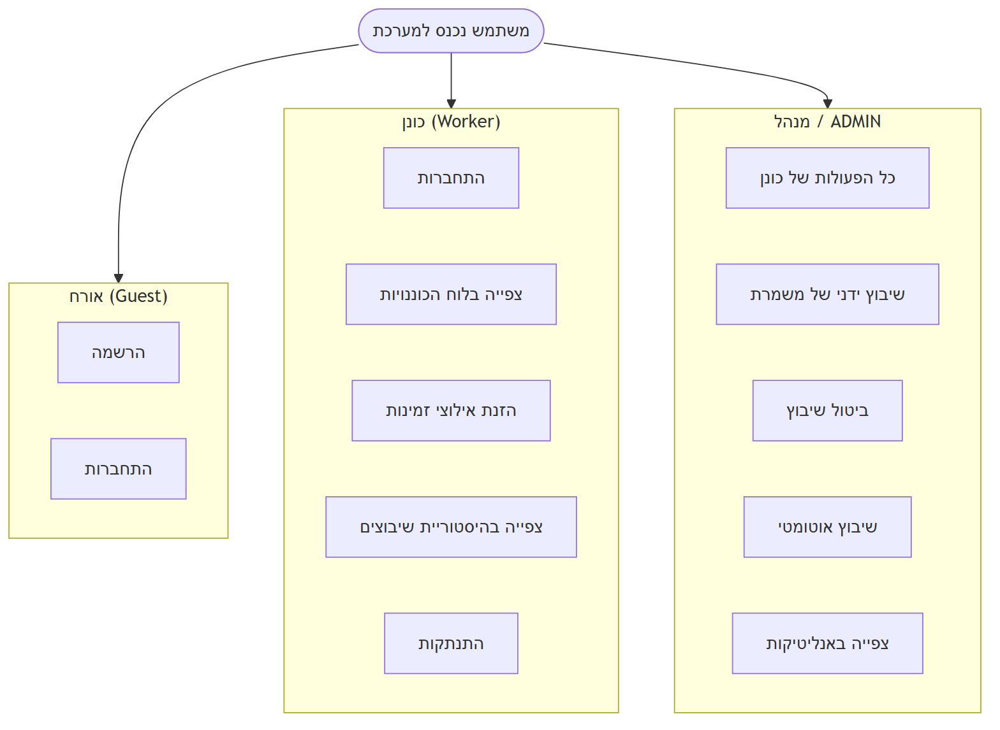
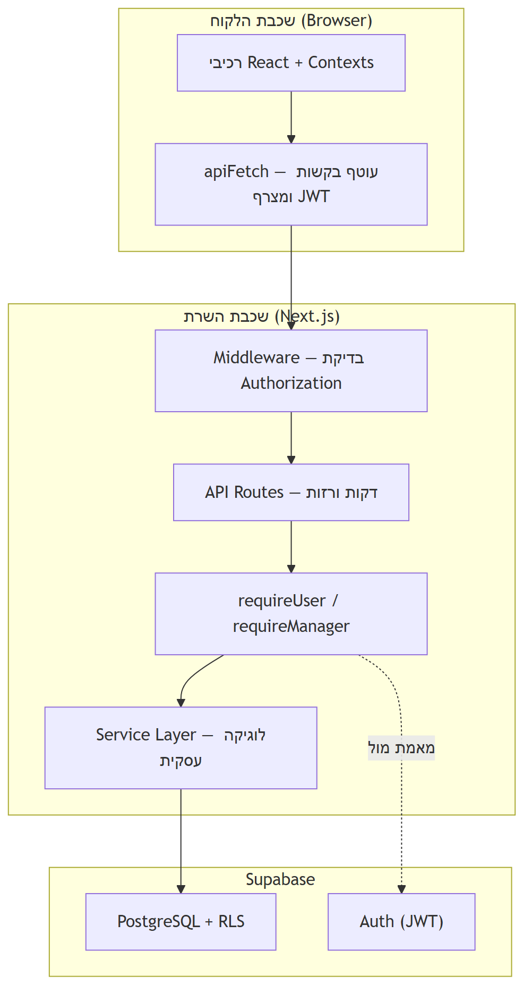
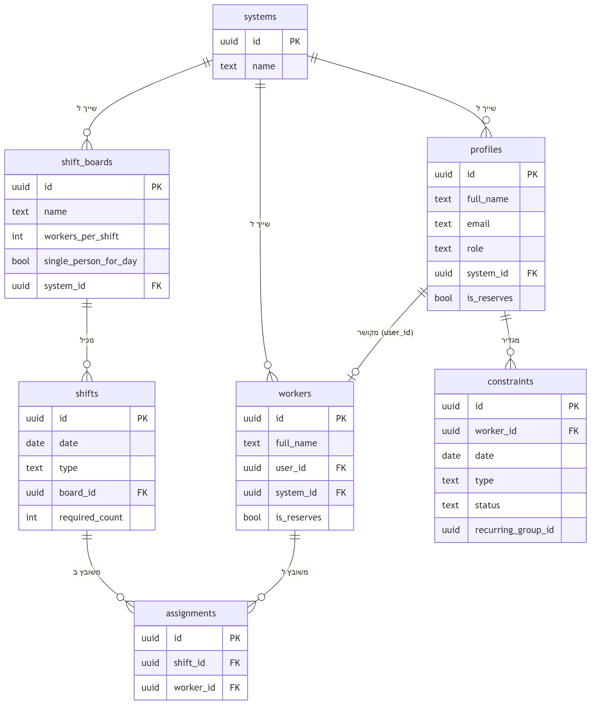
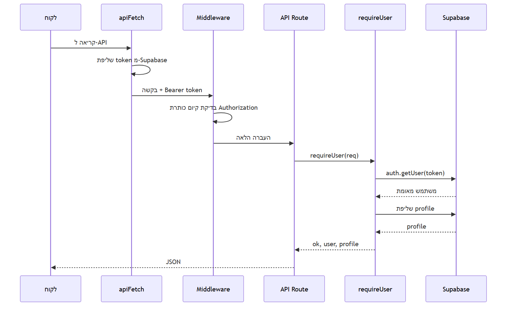
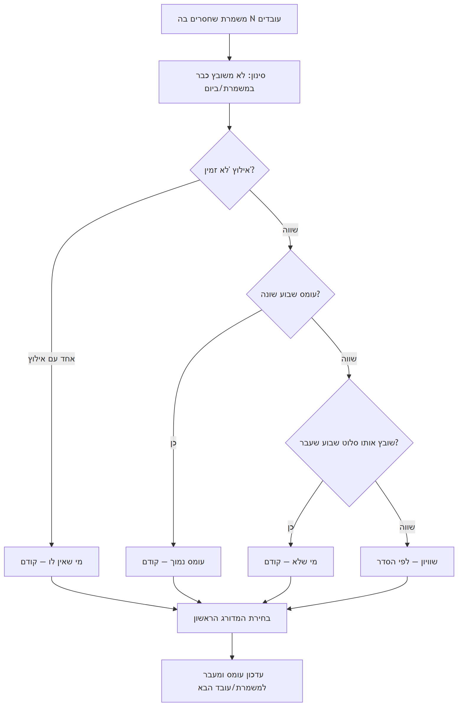
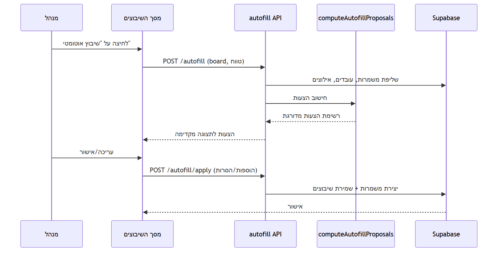

# תיק פרויקט גמר — SmartShift

> **הערה למגישים:** מסמך זה נכתב על בסיס ניתוח קוד המקור של הפרויקט ובהתאמה להצעת הפרויקט שהוגשה. חלקים המסומנים ב-‹...› הם פרטים מנהליים שיש להשלים (תאריך הגשה, ת"ז, חתימות). מומלץ להעתיק ל-Word, לעצב לפי דרישות המכללה (גופן David/Times New Roman, מספרי עמודים, RTL) ולהוסיף צילומי מסך במקומות המסומנים.

---

# 1. פתיח (עמוד שער)

<div align="center">

**שם המכללה:** בסמ"ח (סמל מכללה: 71605)

**מגמת הלימוד:** הנדסת תוכנה

**מסלול הכשרה:** טכנאים מוסמכים

<br>

## נושא פרויקט הגמר
### SmartShift — מערכת חכמה לניהול ושיבוץ כוננויות ומשמרות

<br>

**שם המגישים:** אלה לוי · שי לב טוב

**שם המנחה האישי:** יוסף בדר

**מקום ביצוע הפרויקט:** בסמ"ח

**תאריך הגשה:** ‹תאריך›

<br>

חתימת הסטודנט: \_\_\_\_\_\_\_\_\_\_\_\_\_\_\_\_  חתימת המנחה: \_\_\_\_\_\_\_\_\_\_\_\_\_\_\_\_

</div>

---

# 2. הצעה לפרויקט גמר

> יש לצרף כאן את **הצעת פרויקט הגמר** החתומה (חוזר מנהל מה"ט 51-4-11 – נספח מס' 1), על ידי הסטודנטים והמנחה האישי.

---

# 3. הצהרת הסטודנט

אנו החתומים מטה, **אלה לוי** (ת"ז 302321559) ו**שי לב טוב** (ת"ז 326568839), מצהירים בזאת כי פרויקט הגמר "SmartShift — מערכת חכמה לניהול ושיבוץ כוננויות ומשמרות" נעשה על ידינו בלבד, וכי כל מקור שבו נעזרנו צוין במפורש ברשימת המקורות. הפרויקט לא הוגש ולא יוגש כעבודה זהה לכל מוסד או גורם אחר.

תאריך: ‹תאריך›

חתימת אלה לוי: \_\_\_\_\_\_\_\_\_\_\_\_\_\_\_\_  חתימת שי לב טוב: \_\_\_\_\_\_\_\_\_\_\_\_\_\_\_\_

---

# 4. הבעת הערכה

> חלק אישי — יש לכתוב תודות לאנשים ולמוסדות שסייעו.

ברצוננו להודות למנחה האישי **יוסף בדר** על ההנחיה המקצועית, התמיכה והליווי לאורך הפרויקט, למכללת **בסמ"ח** ולסגל המרצים, ולכל מי שסייע לנו בהכנת פרויקט הגמר.

---

# 5. תקציר

SmartShift היא מערכת ווב לניהול ושיבוץ כוננויות ומשמרות, שפותחה על רקע הצורך המבצעי בהבטחת רציפות תפקודית של מערכות ומענה זמין מסביב לשעון. עד כה נוהלו הכוננויות באופן ידני — לרוב באמצעות הודעות ב-WhatsApp — מה שהוביל להיעדר ראייה מרוכזת של אילוצים וזמינות, לקושי בזיהוי התנגשויות בשיבוץ, ולמעקב לא מסודר אחר היסטוריית השיבוצים. הפרויקט נועד להחליף תהליך זה במערכת דיגיטלית מרכזית, שקופה ואוטומטית.

הליבה הטכנולוגית היא אלגוריתם **שיבוץ אוטומטי** המחשב הצעות שיבוץ על פי שלושה קריטריונים מדורגים: הימנעות מהפרת אילוצי זמינות, איזון עומס בין הכוננים, וגיוון ביחס לשבוע הקודם. המערכת נבנתה כאפליקציית Full-Stack מבוססת Next.js ו-Supabase (PostgreSQL), עם הפרדת הרשאות לפי תפקידים (מנהל / מפקד / כונן / אורח), אבטחת מידע ברמת השורה (RLS) ותמיכה במספר יחידות ארגוניות במקביל. הממשק בעברית (RTL) ותומך במצב כהה. המטרות שנקבעו בהצעת הפרויקט — ניהול לוחות ומשמרות, איסוף אילוצים ושיבוץ אוטומטי מבוקר — הושגו, והתוצר הוא מערכת עובדת מקצה לקצה.

*(‏~200 מילים)*

---

# 6. תוכן העניינים

1. פתיח
2. הצעה לפרויקט גמר
3. הצהרת הסטודנט
4. הבעת הערכה
5. תקציר
6. תוכן העניינים
7. רשימת תרשימים וטבלאות
8. **גוף העבודה**
   - 8.1 מבוא
     - 8.1.1 רקע והמניע לפרויקט
     - 8.1.2 הגדרת הבעיה — המצב הקיים
     - 8.1.3 מטרות הפרויקט והחידוש
     - 8.1.4 דרישות המערכת (פונקציונליות ולא-פונקציונליות)
     - 8.1.5 תרחישי שימוש (Use Case)
   - 8.2 עקרונות התכנון, הבנייה והניתוח
     - 8.2.1 בחירת הטכנולוגיות
     - 8.2.2 ארכיטקטורה כללית
     - 8.2.3 מודל הנתונים (בסיס הנתונים)
     - 8.2.4 מודל ההרשאות והאבטחה
     - 8.2.5 אלגוריתם השיבוץ האוטומטי והאנליטיקות
   - 8.3 תיאור העבודה על פרויקט הגמר
     - 8.3.1 מבנה הפרויקט (תיקיות ושכבות)
     - 8.3.2 שכבת ה-API
     - 8.3.3 שכבת השירותים (Business Logic)
     - 8.3.4 שכבת הלקוח (Frontend)
     - 8.3.5 מסכי המערכת
     - 8.3.6 תרחיש מרכזי — זרימת שיבוץ אוטומטי
     - 8.3.7 בעיות שהתעוררו בפיתוח ופתרונן
   - 8.4 מדידות, בדיקות ותוצאות
9. סיכום, מסקנות והמלצות
10. שונות (משאבים, תוכנית עבודה, בקרת גרסאות)
11. ביבליוגרפיה

---

# 7. רשימת תרשימים וטבלאות

| מס' | סוג | תיאור |
|----|-----|-------|
| תרשים 1 | Use Case | תרחישי שימוש לפי תפקידים (אורח / כונן / מנהל) |
| תרשים 2 | ארכיטקטורה | תרשים שכבות המערכת (Client → API → Service → DB) |
| תרשים 3 | ERD | מודל הנתונים — טבלאות ויחסים |
| תרשים 4 | רצף | זרימת אימות והתחברות (Login / Authentication Flow) |
| תרשים 5 | תרשים זרימה | אלגוריתם דירוג המועמדים לשיבוץ |
| תרשים 6 | רצף | זרימת שיבוץ אוטומטי (Autofill) |
| טבלה 1 | טכנולוגיות | ערימת הטכנולוגיות והגרסאות |
| טבלה 2 | הרשאות | מטריצת תפקידים ↔ פעולות |
| טבלה 3 | API | טבלת נקודות הקצה (Endpoints) |
| טבלה 4 | תוצאות | תרחישי בדיקה ותוצאות |
| טבלה 5 | משאבים | חלוקת תפקידים בצוות |

> **הערה:** לצילומי מסך של המסכים — ראו סעיף 8.3.5. יש להוסיף את הצילומים בפועל ולסמן כ"תמונה 1", "תמונה 2" וכו'.

---

# 8. גוף העבודה

## 8.1 מבוא

### 8.1.1 רקע והמניע לפרויקט

הצורך בפרויקט עלה מתוך סביבה מבצעית: הבטחת רציפות תפקודית של מערכות תוך ניטור פרו-אקטיבי מסביב לשעון. הסביבה המבצעית המורכבת מחייבת זמינות גבוהה של כוח אדם בכל רגע נתון, וזיהוי מוקדם של תקלות או חריגות בזמן אמת. לאור זאת גובש רעיון לפיתוח מערכת חכמה לניהול ושיבוץ כוננים, אשר תאפשר חלוקה אופטימלית של כוח האדם תוך התחשבות בזמינות, בעומסים ובהיסטוריית השיבוצים — ובכך תשפר את היעילות והמוכנות המבצעית ותבטיח מענה רציף ואיכותי לכל אירוע.

### 8.1.2 הגדרת הבעיה — המצב הקיים

עד לפיתוח המערכת, ניהול הכוננויות התבצע בעיקר באמצעות הודעות ב-WhatsApp. שיטה זו הובילה למספר בעיות מרכזיות:

1. **היעדר ראייה מרוכזת** של אילוצי הזמינות והזמינות של כלל הכוננים.
2. **קושי בזיהוי התנגשויות** בשיבוץ (למשל כוננות בשבת בערב ואחריה משמרת ביום ראשון בבוקר).
3. **מעקב לא מסודר** אחר שיבוצים קודמים, ללא היסטוריה ברורה.
4. **בלבול וחוסר אחידות** במידע וקושי במעקב אחר שינויים והחלפות במהלך השבוע.

מצב זה גרם לטעויות חוזרות ולחוסר יעילות. הצורך במערכת מסודרת נובע מהרצון לייצר שקיפות, סדר ומעקב ברור — כך שכל המידע יהיה נגיש, עקבי ומובן לכלל המשתמשים.

### 8.1.3 מטרות הפרויקט והחידוש

מטרת המערכת המרכזית היא לייצר תהליך שיבוץ אופטימלי, המתחשב בפרמטרים מגוונים כגון אילוצים, זמינות והיסטוריית שיבוצים, ובכך לאפשר זמינות גבוהה של כוח אדם. הפרויקט נועד לחדש ולשפר באמצעות **מעבר מניהול ידני ולא מסודר למערכת חכמה ואוטומטית**, אשר:

- מספקת תמונת מצב מלאה בזמן אמת;
- מפחיתה טעויות אנוש;
- משפרת את השקיפות ומייעלת את קבלת ההחלטות;
- מאפשרת תגובה מהירה לשינויים.

### 8.1.4 דרישות המערכת (פונקציונליות ולא-פונקציונליות)

**דרישות לא-פונקציונליות:** עבודה רציפה 24/7, גישה למספר תפקידים במקביל, זמינות ויציבות לאורך זמן, ביצוע שיבוצים ועדכונים בזמן קצר גם תחת עומסים, והגנה על מידע קריטי.

**דרישות פונקציונליות (מתוך ההצעה, ומימושן בפועל):**

| # | דרישה | מומש |
|---|-------|:----:|
| 1 | הרשמת משתמשים חדשים והזנת פרטים (מערכת, אימייל, סוג משתמש) לצורך התאמת הרשאות | ✔ |
| 2 | צפייה מלאה בלוח הכוננויות של כלל המשתמשים | ✔ |
| 3 | שיבוץ, עדכון וביטול כוננויות למשתמשי admin תוך שמירה על עקביות | ✔ |
| 4 | הזנת אילוצי זמינות ומעקב אחריהם בעת השיבוץ | ✔ |
| 5 | שמירת היסטוריית שיבוצים ומניעת עומסים לא מאוזנים | ✔ |
| 6 | דשבורד ותצוגות ויזואליות (עומסים, זמינות, היסטוריה) לסיוע בהחלטות | ✔ (בסיסי) |
| 7 | התראות למשתמשים על שיבוץ חדש או שינוי בכוננות | ✖ (הרחבה עתידית) |

### 8.1.5 תרחישי שימוש (Use Case)

**תרשים 1 — תרחישי שימוש לפי תפקיד:**

{ width=70% }

---

## 8.2 עקרונות התכנון, הבנייה והניתוח

### 8.2.1 בחירת הטכנולוגיות

בהתאם להצעת הפרויקט, נבחרה ארכיטקטורת Client–Server שבה הלקוח פועל בדפדפן ומתקשר עם שרת מרכזי דרך API, והמערכת נפרסת בענן לזמינות גבוהה.

**טבלה 1 — ערימת הטכנולוגיות:**

| רכיב | טכנולוגיה | גרסה | תפקיד |
|------|-----------|------|-------|
| Framework | Next.js (App Router) | 16.2.1 | רינדור צד-שרת, ניתוב, שכבת API (Backend) |
| ספריית UI | React / React DOM | 19.2.3 | בניית ממשק דינמי מבוסס רכיבים (Frontend) |
| שפה | TypeScript | 5.x | שפת הפיתוח הראשית, טיפוסיות סטטית |
| בסיס נתונים ואימות | Supabase (PostgreSQL + Auth + RLS) | 2.98.0 | ניהול נתונים רלציוניים, אימות משתמשים, הרשאות |
| ולידציה | Zod | 4.3.6 | אימות מבנה קלט בזמן ריצה |
| הגבלת קצב | Upstash Redis / Ratelimit | 1.37 / 2.0.8 | הגנה מפני שימוש לרעה |
| עיצוב | Tailwind CSS | v4 | עיצוב, מצב כהה, תמיכת RTL |
| רכיבי UI | Headless UI / Heroicons | 2.2.9 / 2.2.0 | רכיבים נגישים ואייקונים |
| איכות קוד | ESLint / Prettier | 9 / 3.8 | תקן קוד ועיצוב אוטומטי |

**שפות פיתוח:** TypeScript (השפה הראשית), SQL (מיגרציות ושאילתות), HTML/CSS (עיצוב קומפוננטות). **נימוק הבחירה:** יציבות, תמיכה בעבודה מקבילית, יכולת סקיילינג, תחזוקה קלה ותמיכה רחבה בספריות — התאמה למערכת Web מודרנית.

### 8.2.2 ארכיטקטורה כללית

המערכת בנויה בארכיטקטורת שכבות ברורה, כאשר כל שכבה מדברת רק עם השכבה שמתחתיה:

**תרשים 2 — ארכיטקטורת השכבות:**

{ width=55% }

**עקרון מנחה:** נתיבי ה-API (`app/api/`) הם **"דקים"** — הם מאמתים הרשאות, מפרשים את הבקשה, קוראים לפונקציית שירות ומחזירים JSON. כל הלוגיקה העסקית מרוכזת בשכבת השירותים (`features/*/server/`). הפרדה זו משפרת תחזוקתיות ומאפשרת בדיקות יחידה של הלוגיקה במנותק מ-HTTP.

**חלוקה למודולים (מבוסס-תכונות):** הקוד מאורגן לפי תחומים עסקיים ולא לפי סוג קובץ:

```
app/         # מסכים ו-API
features/     # שיבוצים, אילוצים, עובדים ופרופילים
lib/          # הרשאות, DB וכלי עזר
supabase/migrations/  # קבצי SQL למסד הנתונים
```

### 8.2.3 מודל הנתונים (בסיס הנתונים)

האחסון הראשי מתבצע ב-PostgreSQL של Supabase. אין שימוש ב-ORM — הגישה לנתונים מתבצעת ישירות דרך Supabase JS SDK בשאילתות פרמטריות. בסיס הנתונים כולל שבע טבלאות מרכזיות: `systems`, `profiles`, `workers`, `shifts`, `shift_boards`, `assignments`, `constraints`.

**תרשים 3 — מודל הנתונים (ERD):**

{ width=95% }

**מבני הנתונים המרכזיים:**
- **System** — יחידה ארגונית (רב-דיירות / Multi-tenancy).
- **Profile** — פרופיל משתמש והרשאות.
- **Worker** — עובד/כונן שניתן לשבץ (עשוי להיות ללא חשבון משתמש).
- **Shift** — משמרת (תאריך + סוג + מספר עובדים נדרש).
- **ShiftBoard** — לוח שיבוצים (תבנית).
- **Constraint** — אילוצי זמינות.
- **Assignment** — שיוך עובד למשמרת.

**החלטות תכנון מרכזיות:**
- **הפרדה בין `profiles` ל-`workers`:** משתמש רשום הוא ישות אימות, בעוד `worker` הוא ישות שניתן לשבץ. ההפרדה מאפשרת למנהל להוסיף כונן למאגר עוד לפני שנרשם (עם `user_id = null`), וכשהכונן נרשם — הפרופיל מקושר אוטומטית.
- **רב-דיירות (`system_id`):** כל הטבלאות נושאות `system_id`, המאפשר למספר יחידות ארגוניות לפעול בבידוד מלא.
- **אילוצים מחזוריים:** אילוצים שנוצרו יחד (מחזור שבועי או טווח) חולקים `recurring_group_id` — מאפשר עריכה/מחיקה של סדרה שלמה.

בנוסף, בזיכרון (Runtime) נעשה שימוש במבני עזר `Map` ו-`Set` לבדיקות מהירות עבור אלגוריתם השיבוץ.

### 8.2.4 מודל ההרשאות והאבטחה

המערכת מגדירה ארבעה תפקידים: **מנהל (manager)**, **מפקד (commander)**, **כונן (worker)** ו**אורח (guest)**. הפונקציה `canManage(role)` מחזירה "אמת" למנהל ולמפקד.

**טבלה 2 — מטריצת הרשאות:**

| פעולה | מנהל / מפקד | כונן | אורח |
|-------|:-----------:|:----:|:----:|
| צפייה בלוח הכוננויות | ✔ | ✔ | ✔ |
| יצירה/עריכה/מחיקה של משמרות ולוחות | ✔ | ✖ | ✖ |
| שיבוץ וביטול שיבוץ | ✔ | ✖ | ✖ |
| הפעלת שיבוץ אוטומטי | ✔ | ✖ | ✖ |
| ניהול אילוצים אישיים | ✔ | ✔ | ✖ |
| צפייה באילוצי כלל הכוננים | ✔ | ✖ | ✖ |
| קידום עובד לתפקיד ניהולי | ✔ | ✖ | ✖ |

**אבטחה בשלוש שכבות (Defense-in-Depth)** — בהתאם לאזורי האבטחה שהוגדרו בהצעה (שרת, בקרת גישה, חשבונות, מסד נתונים):

1. **Middleware ותקשורת** — כל בקשה ל-`/api/*` (למעט נתיבים ציבוריים כהרשמה) חייבת לשאת כותרת `Authorization: Bearer <token>`. בסביבת ייצור התקשורת מוצפנת ב-HTTPS.
2. **בקרת גישה בקוד (RBAC)** — כל נתיב מוגן קורא ל-`requireUser()` או `requireManager()` לפני כל פעולה, ופונקציות `assert*Ownership()` מוודאות שהמשאב שייך ליחידת המשתמש.
3. **Row-Level Security (RLS)** — מדיניות ברמת בסיס הנתונים אוכפת, למשל, שכונן יכול לקרוא/לערוך רק את האילוצים שבהם `worker_id = auth.uid()`, גם אם שכבת הקוד תיכשל.

**אמצעי אבטחה נוספים:**
- **חשבונות משתמשים:** סיסמאות נשמרות מוצפנות (Hash) על ידי Supabase Auth; אכיפת סיסמאות חזקות.
- **הגבלת קצב (Rate Limiting):** על נקודות קצה רגישות (הרשמה: 5 בקשות/דקה; שיבוץ אוטומטי: 10/דקה) בעזרת Upstash Redis, כהגנה מפני ניסיונות התחברות חוזרים ושימוש לרעה.
- **הגנה מפני SQL Injection:** שימוש בשאילתות פרמטריות דרך Supabase SDK.
- **Content-Security-Policy** וכותרות אבטחה (X-Frame-Options: DENY, HSTS, nosniff) המוגדרות ב-`next.config`.
- **הודעות שגיאה בטוחות** (`lib/utils/errors.ts`) — חושפות רק שגיאות מבוקרות ומחזירות "שגיאת שרת פנימית" לכל השאר, כדי לא לדלוף פרטי מימוש.

**תרשים 4 — זרימת אימות והתחברות (Login Flow):**

{ width=70% }

### 8.2.5 אלגוריתם השיבוץ האוטומטי והאנליטיקות

**המרכיב האלגוריתמי המרכזי** במערכת הוא מנגנון שיבוץ המשמרות האוטומטי — הפונקציה `computeAutofillProposals()` (בקובץ `lib/assignments/autofill.ts`). האלגוריתם הוא **חמדני (Greedy)** עם דירוג רב-קריטריוני: עבור כל משמרת שחסרים בה עובדים, הוא מדרג את המועמדים הזמינים ובוחר את המתאים ביותר. האלגוריתם מקבל נתוני עובדים, משמרות, אילוצים ושיבוצים קודמים, ומשתמש במבני `Map` ו-`Set` לבדיקות מהירות של זמינות, עומס, שיבוצים קיימים והיסטוריה.

**סינון מקדים** — מועמד נפסל אם:
- הוא כבר משובץ באותה משמרת, או
- הוא כבר משובץ למשמרת אחרת באותו תאריך (מניעת שיבוץ כפול ביום).

**דירוג המועמדים** — הנותרים ממוינים לפי שלושה קריטריונים לפי סדר עדיפות:
1. **אילוץ זמינות** — עובד ללא אילוץ "לא זמין" (`unavailable`) קודם לעובד עם אילוץ.
2. **עומס שיבוץ** — עובד עם פחות שיבוצים השבוע קודם (איזון עומס).
3. **גיוון** — עובד שלא שובץ לאותה משמרת/תאריך בשבוע שעבר קודם (מניעת שגרה).

**תרשים 5 — לוגיקת דירוג המועמדים:**

{ width=60% }

חשוב להדגיש: האלגוריתם מייצר **הצעה בלבד**. המנהל צופה בתצוגה מקדימה (Preview), רשאי להחליף כל שיבוץ מוצע, ורק לאחר אישור מפורש השיבוץ נשמר. גישה זו משלבת יעילות אוטומטית עם שליטה אנושית מלאה.

**אנליטיקות:** המערכת אוספת נתוני עובדים, משמרות ושיבוצים מתוך מסד הנתונים ומציגה בדשבורד סטטיסטיקות כגון מספר משמרות לעובד, חלוקה למשמרות יום/לילה, עומס עבודה שבועי, ומשמרות מלאות/חסרות עובדים — לסיוע בקבלת החלטות בשיבוץ הידני.

---

## 8.3 תיאור העבודה על פרויקט הגמר

### 8.3.1 מבנה הפרויקט (תיקיות ושכבות)

```
app/
  (auth)/         # מסכי התחברות והרשמה
  (dashboard)/    # מסכי המערכת המוגנים
  api/            # נתיבי API (רזים)
features/         # לוגיקה עסקית לפי תחום
  assignments/  constraints/  profile/  workers/
lib/
  api/apiFetch.ts        # עוטף בקשות לקוח (מצרף JWT)
  auth/                  # requireUser, requireManager, assertOwnership
  db/                    # לקוחות Supabase (server/browser/admin)
  assignments/autofill.ts# אלגוריתם השיבוץ
  utils/                 # enums, interfaces, schemas (Zod), errors
supabase/migrations/     # קבצי מיגרציה של סכמת בסיס הנתונים
components/               # רכיבי UI כלליים
```

### 8.3.2 שכבת ה-API

נקודות הקצה מרוכזות תחת `app/api/`. כל נתיב מאמת הרשאה, מבצע ולידציה עם Zod, וקורא לשירות המתאים.

**טבלה 3 — נקודות הקצה המרכזיות (בחירה):**

| Method | Endpoint | הרשאה | תיאור |
|--------|----------|-------|-------|
| GET | `/api/assignments` | משתמש | סקירת שיבוצים מלאה (משמרות, שיבוצים, עובדים, אילוצים, לוחות) |
| POST | `/api/assignments` | מנהל | שיבוץ עובד למשמרת |
| DELETE | `/api/assignments` | מנהל | הסרת שיבוץ |
| POST | `/api/assignments/autofill` | מנהל | תצוגה מקדימה של שיבוץ אוטומטי |
| POST | `/api/assignments/autofill/apply` | מנהל | החלת שיבוץ אוטומטי (הוספות/הסרות) |
| GET/POST | `/api/shifts` | משתמש / מנהל | צפייה / יצירת משמרת |
| PATCH/DELETE | `/api/shifts/[id]` | מנהל | עדכון / מחיקת משמרת |
| GET/POST | `/api/constraints` | משתמש | צפייה / יצירת אילוץ (חד-פעמי/מחזורי/טווח) |
| PATCH/DELETE | `/api/constraints/[id]` | משתמש | עדכון / מחיקת אילוץ (בודד או סדרה) |
| GET/POST | `/api/boards` | משתמש / מנהל | צפייה / יצירת לוח |
| GET/POST/DELETE | `/api/workers` | מנהל | ניהול מאגר העובדים |
| GET | `/api/profiles` | מנהל | רשימת המשתמשים ביחידה |
| POST | `/api/profiles/[id]/promote` | מנהל | קידום עובד לתפקיד ניהולי |
| GET/POST | `/api/systems` | ציבורי / מנהל | רשימת יחידות / יצירת יחידה |
| POST | `/api/auth/signup` | ציבורי | הרשמת משתמש חדש |

### 8.3.3 שכבת השירותים (Business Logic)

הלוגיקה העסקית מרוכזת ב-`features/*/server/*.service.ts`. דוגמאות מרכזיות:

- **`assignments.service.ts`** — `getAssignmentsOverview()` שולף במקביל את כל הנתונים למסך הראשי, כולל **סנכרון עובדים** אוטומטי: יצירת רשומת `worker` לכל פרופיל חדש בעל תפקיד עובד/מנהל, וסינון אורחים. כן: `createAssignment()` ו-`deleteAssignment()` הכוללות בדיקת בעלות.
- **`autofill.service.ts`** — `previewAutofill()` מחשב הצעות (ללא שמירה), ו-`applyAutofill()` מבצע את השמירה: יוצר משמרות חסרות לפי הגדרת הלוח, מוחק הסרות ומכניס הוספות.
- **`constraints.service.ts`** — `createConstraint()` המפצל לשלושה סוגים: בודד, מחזורי (יום קבוע לאורך שנה), וטווח תאריכים (עם `recurring_group_id` משותף).
- **`profile.service.ts`** — `ensureProfile()` יוצר/מסנכרן פרופיל לאחר התחברות, כולל לוגיקת קביעת תפקיד (המשתמש הראשון ביחידה הופך למנהל) וקישור העובד.
- **`workers.service.ts`** — ניהול מאגר העובדים, כולל מניעת מחיקת עובד המקושר למשתמש רשום.

### 8.3.4 שכבת הלקוח (Frontend)

ניהול המצב בצד הלקוח מבוסס על **React Context** עם מטמון ברמת המודול השורד ניווט בין מסכים:

- **`ProfileContext`** — מחזיק את פרופיל המשתמש הנוכחי גלובלית, ומאזין לשינויי אימות (התנתקות / רענון טוקן).
- **`AssignmentsContext`** — טוען וממטמן את סקירת השיבוצים, עם עדכונים אופטימיים (Optimistic updates) לאחר שיבוץ.
- **`ConstraintsContext`** — מנהל את רשימת האילוצים ואת חברי היחידה (למנהל).

כל קריאות ה-API מהלקוח עוברות דרך `lib/api/apiFetch.ts`, העוטף `fetch` ומצרף אוטומטית את ה-JWT. הממשק (GUI) מבוסס Web עם תמיכת RTL, מצב כהה (Dark Mode) והתאמה למובייל ולדסקטופ.

### 8.3.5 מסכי המערכת

> **הערה:** להוסיף כאן צילום מסך לכל מסך (תמונה 1–5).

1. **מסך התחברות / הרשמה** (`/login`, `/signup`) — בהרשמה בוחר המשתמש יחידה וסוג משתמש (כונן רגיל / כונן במילואים / אורח).
2. **לוח המחוונים (Dashboard)** (`/dashboard`) — תצוגה שבועית של המשמרות (יום/לילה), סטטיסטיקות אישיות, ניווט בין שבועות, וסימון סטטוס מילוי בצבעים (ירוק=מלא, כתום=חלקי, אדום=ריק).
3. **מסך השיבוצים** (`/assignments`) — מסך הניהול המרכזי: תצוגת לוח שבועי או רשימה, שיבוץ עובדים בלחיצה, יצירת משמרות ולוחות, וכפתור השיבוץ האוטומטי הפותח חלון תצוגה מקדימה.
4. **מסך האילוצים** (`/constraints`) — יצירת אילוצים (בודד/מחזורי/טווח), סינון לפי תאריך ועובד, ומחיקת סדרה שלמה.
5. **מסך הגדרות** (`/settings`).

### 8.3.6 תרחיש מרכזי — זרימת שיבוץ אוטומטי

**תרשים 6 — זרימת שיבוץ אוטומטי:**

{ width=72% }

### 8.3.7 בעיות שהתעוררו בפיתוח ופתרונן

בהתאם לבעיות שנצפו בהצעת הפרויקט, להלן ההתמודדות בפועל:

| בעיה צפויה | פתרון שיושם / מתוכנן |
|-----------|----------------------|
| עומסים גבוהים (ריבוי שיבוצים ועדכונים במקביל) | פריסה בענן (Vercel) הניתנת להרחבה + הגבלת קצב על נקודות רגישות |
| ניהול מידע לאורך זמן (היסטוריית שיבוצים גדולה) | אינדקסים על עמודות מפתח (`date`, `worker_id`, `shift_id`) + מטמון בצד הלקוח |
| התנגשויות בעדכונים (שינויים במקביל) | אילוץ ייחודיות `UNIQUE(shift_id, worker_id)` במסד + בדיקות בעלות לפני עדכון |

**מגבלה ידועה:** פעולות בודדות במסד הנתונים אטומיות, אך פעולות מורכבות מרובות-שלבים אינן עטופות עדיין בטרנזקציה מלאה — ולכן במקרה קריסה נדיר ייתכנו שינויים חלקיים. עטיפה בטרנזקציה מלאה נכללת בהמלצות להמשך.

---

## 8.4 מדידות, בדיקות ותוצאות

מאחר שמדובר במערכת תוכנה, ה"מדידות" הן בעיקר **בדיקות פונקציונליות** ואימות עמידה בדרישות. תוכנית הבדיקות (מתוך ההצעה) כללה בדיקות תהליכיות (Full Flow) ובדיקות יחידה (Unit Tests).

**טבלה 4 — בדיקות תהליכיות (Full Flow) שבוצעו ידנית:**

| # | תרחיש | תוצאה מצופה | תוצאה בפועל |
|---|-------|-------------|-------------|
| 1 | הרשמה והתחברות משתמש | משתמש ראשון ביחידה מקבל תפקיד "מנהל" | ✔ |
| 2 | יצירת עובד חדש על ידי מנהל | העובד נוסף למאגר (ללא חשבון) | ✔ |
| 3 | יצירת אילוצי זמינות לעובד | האילוץ נשמר ומשויך למשתמש | ✔ |
| 4 | יצירת משמרות ושיבוץ ידני | השיבוץ נשמר, המשמרת מתעדכנת | ✔ |
| 5 | שיבוץ עובד עם אילוץ | מוצגת אזהרת אילוץ לפני שמירה | ✔ |
| 6 | מניעת שיבוץ כפול באותו יום | לא ניתן לשבץ עובד פעמיים ביום | ✔ |
| 7 | ביצוע שיבוץ אוטומטי | הצעות מדורגות לפי זמינות/עומס/גיוון | ✔ |
| 8 | אילוץ מחזורי + מחיקת סדרה | נוצרת/נמחקת סדרה עם `recurring_group_id` | ✔ |
| 9 | מעבר בין שבועות ולוחות | התצוגה מתעדכנת נכון | ✔ |
| 10 | הרשאות — כונן מנסה לשבץ | נדחה (403) | ✔ |
| 11 | בידוד בין יחידות | מנהל אינו רואה לוחות של יחידה אחרת | ✔ |
| 12 | הגבלת קצב | בקשת הרשמה מעבר למכסה נדחית (429) | ✔ |

**בדיקות יחידה (Unit Tests):** בהתאם להצעה תוכננו בדיקות יחידה לאלגוריתם השיבוץ (מניעת כפילות, התחשבות באילוצים, איזון עומס), לאימות ולהרשאות. מסגרת הבדיקות המומלצת היא **Vitest**, עם Mock ל-Supabase כך שהבדיקות אינן תלויות במסד נתונים אמיתי. מימוש מלא של מערך הבדיקות האוטומטי נכלל בהמלצות להמשך.

**חישוב מורכבות אלגוריתם השיבוץ:** עבור *S* משמרות, *W* עובדים ו-*R* עובדים נדרשים לכל משמרת, המורכבות היא כ-*O(S · R · W log W)* — לכל מקום פנוי מתבצע מיון של המועמדים. עבור ממדים ריאליסטיים (עשרות עובדים ומשמרות בשבוע) זמן החישוב זניח (מילי-שניות בודדות).

---

# 9. סיכום, מסקנות והמלצות

## סיכום

הפרויקט השיג את מטרותיו כפי שנקבעו בהצעה: נבנתה מערכת ווב מלאה מקצה-לקצה לניהול ושיבוץ כוננויות ומשמרות, המחליפה את הניהול הידני ב-WhatsApp. המערכת מאפשרת ניהול לוחות ומשמרות, איסוף אילוצי זמינות מגוונים (חד-פעמי / מחזורי / טווח), ושיבוץ אוטומטי חכם המתחשב בו-זמנית בזמינות, בעומס ובגיוון — כשהמנהל שומר על שליטה מלאה באמצעות אישור ההצעות. המערכת נשענת על ארכיטקטורה שכבתית נקייה, מודל הרשאות מבוסס-תפקידים, ואבטחת מידע בשלוש שכבות (Middleware, קוד, RLS).

## מסקנות

1. **הפרדת שכבות משתלמת** — הפרדת ה-API הרזה משכבת השירותים הקלה על פיתוח, איתור תקלות והרחבה.
2. **RLS כשכבת הגנה שנייה** — אכיפת הרשאות בבסיס הנתונים עצמו מספקת ביטחון גם אם שכבת הקוד תיכשל.
3. **אלגוריתם שקוף עדיף על "קופסה שחורה"** — מודל "הצעה ואישור" מייצר אמון: המנהל מקבל את יעילות האוטומציה מבלי לוותר על שיקול הדעת האנושי.
4. **ההפרדה בין `worker` ל-`profile`** התגלתה כהחלטת תכנון חשובה, המאפשרת שיבוץ כוננים עוד לפני הרשמתם.

## המלצות להמשך פיתוח

- **התראות (Notifications)** — התראות דוא"ל/הודעות על שיבוץ חדש או שינוי, כפי שהוגדר בהצעה כדרישה עתידית.
- **עדכונים בזמן אמת** באמצעות Supabase Realtime (WebSocket) לעדכון מסכים מרובי-משתמשים.
- **טרנזקציות מלאות** — עטיפת פעולות מרובות-שלבים בטרנזקציה למניעת שינויים חלקיים בקריסה.
- **הרחבת האנליטיקות** — דשבורד מתקדם (ניצולת כוננים, פערי כיסוי, מגמות).
- **מערך בדיקות אוטומטי** (Vitest) לשכבת השירותים ולאלגוריתם.
- **שקילת אילוצים "חלקיים" (partial)** בצורה מדורגת ומשקלים מתכווננים לקריטריונים.

---

# 10. שונות

## 10.1 משאבים וחלוקת תפקידים

היקף הפרויקט הוערך בכ-**120–180 שעות עבודה**, בביצוע צוות של שני חברים.

**טבלה 5 — חלוקת תפקידים:**

| חבר צוות | תחום אחריות עיקרי |
|----------|-------------------|
| אלה לוי | הובלת Backend — תכנון מסד נתונים, הגדרת Supabase, אימות משתמשים, API, הרשאות, לוגיקת שיבוץ ומיגרציות |
| שי לב טוב | הובלת Frontend / Full-stack — מסכי Next.js, רכיבי React, טפסים, דשבורד, ממשק RTL, עיצוב ובדיקות ידניות |

> את החלוקה המדויקת יש להתאים לפי הביצוע בפועל. שני חברי הצוות השתתפו בהגדרת דרישות, תכנון שבועי, Code Reviews, בדיקות QA ידניות והכנת התיעוד.

## 10.2 תוכנית עבודה ושלבי המימוש

1. אפיון ותכנון המערכת
2. הקמת פרויקט Next.js וחיבור Supabase
3. בניית מסד נתונים, הרשאות והתחברות
4. פיתוח API ו-Backend
5. פיתוח ממשק משתמש ודשבורד
6. מימוש אלגוריתם שיבוץ אוטומטי
7. הצגת אנליטיקות וסטטיסטיקות
8. בדיקות ותיקון תקלות
9. Deployment ותיעוד סופי

## 10.3 סביבת עבודה ובקרת גרסאות

- **סביבת פיתוח:** Visual Studio Code, מנהל חבילות Yarn.
- **בקרת גרסאות:** Git / GitHub (ענפי `main` ו-`develop`).
- **פקודות הרצה:** `yarn dev` (פיתוח), `yarn build` (בנייה), `yarn start` (הרצה), `yarn lint` (בדיקת קוד).
- **פריסה (Deployment):** בענן (למשל Vercel) + שירותי Supabase בענן.
- **משתני סביבה נדרשים:** `NEXT_PUBLIC_SUPABASE_URL`, `NEXT_PUBLIC_SUPABASE_ANON_KEY`, ואופציונלי `SUPABASE_SERVICE_ROLE_KEY`.

---

# 11. ביבליוגרפיה

## מקורות בעברית / כלליים
1. תיעוד Next.js — Next.js Documentation. https://nextjs.org/docs
2. תיעוד React — React Documentation. https://react.dev
3. תיעוד Supabase — Supabase Documentation. https://supabase.com/docs

## מקורות באנגלית
4. Vercel Inc. *Next.js App Router*. https://nextjs.org/docs/app
5. Supabase. *Row Level Security (RLS) Policies*. https://supabase.com/docs/guides/auth/row-level-security
6. PostgreSQL Global Development Group. *PostgreSQL Documentation*. https://www.postgresql.org/docs/
7. Colin McDonnell. *Zod — TypeScript-first schema validation*. https://zod.dev
8. Tailwind Labs. *Tailwind CSS Documentation*. https://tailwindcss.com/docs
9. Upstash. *Ratelimit Documentation*. https://upstash.com/docs/redis/sdks/ratelimit-ts/overview
10. Mozilla Developer Network. *Content Security Policy (CSP)*. https://developer.mozilla.org/en-US/docs/Web/HTTP/CSP

> יש להתאים את פורמט הביבליוגרפיה לתקן הנדרש (למשל APA) ולהוסיף תאריכי גישה.
